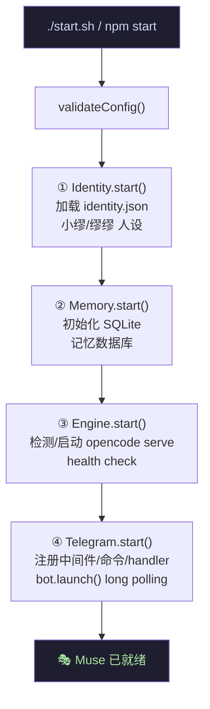
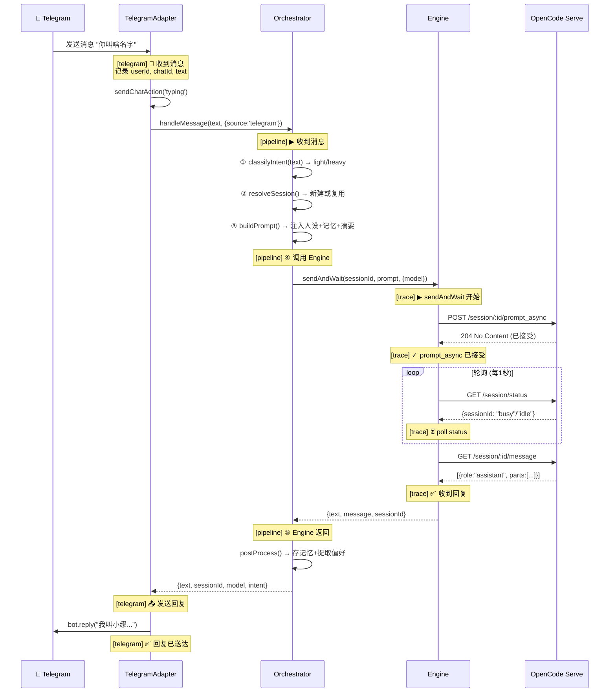
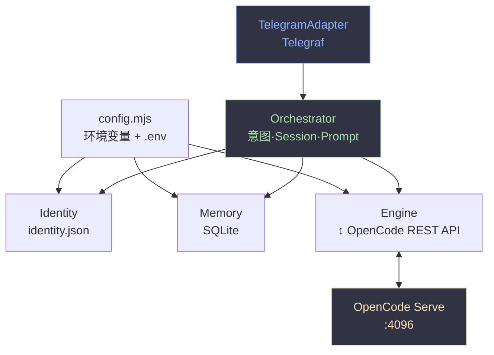

# Muse 核心模块

> Muse 是基于 OpenCode 的 AI 伴侣框架。本文档说明启动流程、消息生命周期和架构。

---

## 启动流程

运行 `./start.sh` 或 `npm start` 后，系统按依赖顺序启动 5 个模块（Web 优先，确保诊断入口可用）：



### 启动细节

| 阶段 | 模块 | 做了什么 | 失败影响 |
|------|------|---------|---------|
| ① | Identity | 读 `identity.json` → 人设/名字/性格 | 启动失败 |
| ② | Memory | 创建/打开 `muse/data/memory.db` (SQLite) | 启动失败 |
| ③ | Engine | `curl /global/health` 探活 → 已在跑就 attach，否则 `spawn opencode serve --port 4096` | 启动失败 |
| ④ | Telegram | 注册中间件（私聊/白名单）→ 注册命令 → 注册消息 handler → `bot.launch()` | 启动失败 |

---

## 消息生命周期

当你从 Telegram 发一条消息到 bot，完整链路如下：



---

## 日志标签速查

| 标签 | 层级 | 含义 |
|------|------|------|
| `[telegram]` | 适配器 | 📩 收到 / 📤 发送 / ✅ 送达 / ✖ 错误 |
| `[pipeline]` | 编排器 | ① 意图 → ② session → ③ prompt → ④ engine → ⑤ 返回 |
| `[trace:xxx]` | 引擎 | ▶ 开始 → ✓ 已接受 → ⏳ poll → ✅ 收到 / ✖ 超时 |
| `[engine]` | 引擎 | 启动/停止/health check |
| `[identity]` | 身份 | 加载人设 |
| `[memory]` | 记忆 | 数据库操作 |

---

## 模块依赖图



---

## 文件结构

```
muse/
├── index.mjs          # 入口: createModules() → startAll() → shutdown
├── config.mjs         # 配置加载 + normalizeModel()
├── logger.mjs         # 日志工具 (createLogger)
├── core/
│   ├── identity.mjs   # 人设加载 (identity.json)
│   ├── memory.mjs     # SQLite 记忆系统
│   ├── engine.mjs     # OpenCode REST API 客户端
│   └── orchestrator.mjs # 消息编排 (意图·Session·Prompt·后处理)
├── adapters/
│   └── telegram.mjs   # Telegram Bot (Telegraf)
└── data/
    ├── identity.json   # 小缪人设定义
    └── memory.db       # SQLite 记忆数据库 (自动创建)
```

---

## 关键配置

| 文件 | 作用 |
|------|------|
| `opencode.json` | OpenCode 原生配置 (model, username) |
| `.env` | 环境变量 (Telegram Token, 模型, 端口) |
| `muse/data/identity.json` | 人设 (名字, 性格, MBTI, 风格) |

---

## 启动方式

```bash
# 推荐: 自动保存日志到 logs/
./start.sh

# 或直接启动 (日志仅在终端)
npm start
```

日志文件: `logs/muse_YYYY-MM-DD_HHMMSS.log`

---

## 排障流程

```
消息没回复？
    ↓
看 [telegram] 📩 → 没有? → 检查 bot token / 白名单
    ↓
看 [pipeline] → 卡在哪步?
    ↓
看 [trace] → status=unknown? → 检查 OpenCode 日志
    ↓
OpenCode 日志: ~/.local/share/opencode/log/
```
