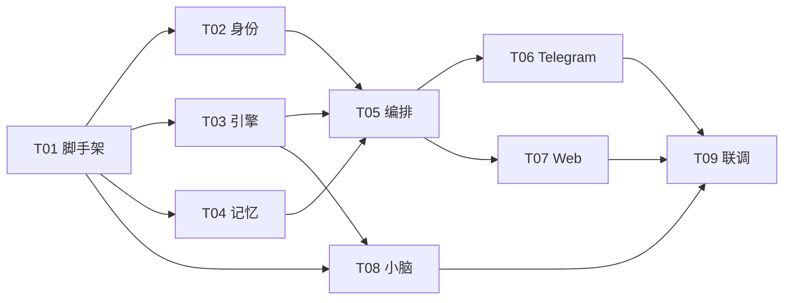

# Phase 1 — MVP 任务地图

> 目标：跑通核心循环 — Telegram 对话 → 有记忆 → 有人格 → 能干活 → 死了能活
>
> 预计周期：2-3 周

---

## 核心架构：大脑 + 小脑

Muse 助手的核心是 **OpenCode**，整体采用 **大脑/小脑** 双进程架构：

```
                        ┌──────────────┐
                        │   用户交互    │
                        │ TG / Web / CLI│
                        └──────┬───────┘
                               │
                        ┌──────▼───────┐
                        │   编排层      │  ← orchestrator (在大脑进程内)
                        │ 身份+记忆+路由 │
                        └──────┬───────┘
                               │
              ┌────────────────▼────────────────┐
              │        大 脑 (Cortex)             │
              │      opencode serve 进程          │
              │  推理 · 对话 · 工具调用 · 代码     │
              └────────────────▲────────────────┘
                               │ healthCheck / restart
              ┌────────────────▼────────────────┐
              │       小 脑 (Cerebellum)          │
              │      独立 Node.js 进程            │
              │                                   │
              │  • 健康监控 — 心跳 + 异常检测      │
              │  • 进程管理 — 重启大脑 + 自恢复     │
              │  • 会话管理 — 僵尸 session 清理     │
              └─────────────────────────────────┘
                               │
                        ┌──────▼───────┐
                        │   launchd     │  ← 系统级：只负责拉起小脑
                        └──────────────┘
```

**核心原则**：
- **大脑** = OpenCode serve — 负责高级认知（推理、对话、工具调用）
- **小脑** = 独立守护进程 — 负责维持性工作（监控、重启、清理），大脑 crash 不影响小脑
- **launchd** 只管小脑，小脑管大脑，形成**两级守护**
- **不改 OpenCode 源码** — 通过 Plugin / Hook / MCP / Skill 扩展
- **Multi-Agent 预留** — Schema 和配置预留 `agent_id`，Phase 1 跑单 agent，Phase 4 扩展为 Agent 家庭

---

## 任务总览

```
Phase 1 MVP ✅
├── T01 项目脚手架        ✅ 地基：项目结构 + 依赖 + 配置
├── T02 身份系统          ✅ 灵魂：identity.json + system prompt 生成
├── T03 引擎层            ✅ 大脑：OpenCode serve 封装 + REST 交互
├── T04 记忆层            ✅ 记忆：4 层记忆 SQLite 实现 (含 agent_id 预留)
├── T05 编排层            ✅ 神经：意图路由 + 记忆注入 + 模型选择
├── T06 Telegram 适配器   ✅ 嘴巴：Bot 交互 + 命令 + 文件收发
├── T07 Web 驾驶舱        ✅ 仪表：身份配置 + 聊天记录 + 状态
├── T08 小脑 (Cerebellum) ✅ 守护：健康监控 + 进程重启 + 会话清理
└── T09 集成联调          ✅ 验收：8项集成测试 + 手动清单
```

---

## 任务依赖关系



**关键路径**：T01 → T03/T04 → T05 → T06 → T09

---

## 各任务详情

### T01 项目脚手架 `(0.5 天)`

| 项 | 内容 |
|----|------|
| **目标** | 建立项目基础：ESM + 依赖 + 配置系统 + 入口文件 |
| **产出** | `package.json`, `config.mjs`, `index.mjs`, `.env.example` |
| **依赖** | 无 |
| **技术** | Node.js ESM, dotenv, better-sqlite3, telegraf |

---

### T02 身份系统 `(0.5 天)`

| 项 | 内容 |
|----|------|
| **目标** | 定义助手身份配置 + 生成 system prompt |
| **产出** | `identity.json`（默认小姐姐人设）, `core/identity.mjs` |
| **依赖** | T01 |
| **技术** | JSON 配置, AIEOS 启发的结构 |
| **关键点** | 性格滑块 → prompt 语句映射, Web 可编辑 |

---

### T03 引擎层 `(1-2 天)`

| 项 | 内容 |
|----|------|
| **目标** | 封装 OpenCode REST API，auto-spawn + 健康检查 + 消息收发 |
| **产出** | `core/engine.mjs` |
| **依赖** | T01 |
| **技术** | fetch, child_process, AbortSignal |
| **关键点** | 自动启动 opencode serve, 超时处理, 流式响应解析 |

**核心接口**：
```javascript
class Engine {
  async ensureRunning()           // 确保 opencode serve 运行
  async healthCheck()             // GET /provider
  async chat(sessionId, message)  // POST /session/:id/message
  async createSession()           // POST /session
  async listSessions()            // GET /session
}
```

---

### T04 记忆层 `(2 天)`

| 项 | 内容 |
|----|------|
| **目标** | 实现记忆体系的基础存储层 |
| **产出** | `core/memory.mjs`, `data/memory.db` |
| **依赖** | T01 |
| **技术** | better-sqlite3, SQL schema |
| **关键点** | 语义记忆(KV), 情景记忆(对话log+摘要), agent_id 预留 |

**记忆体系**（2 层存储 + 2 外部依赖）：

| 类型 | 存储 | Phase 1 实现 | 归属模块 |
|----|------|-------------|---------|
| 身份 | identity.json | 直接读文件 | Identity 模块 |
| 语义 | SQLite `semantic_memory` 表 | key-value CRUD | **Memory 模块** |
| 情景 | SQLite `episodic_memory` 表 | 对话全文 + 日期 | **Memory 模块** |
| 工作 | OpenCode session 上下文窗口 | engine 代理 | Engine/OpenCode |

> **Multi-Agent 预留**：所有 SQLite 表增加 `agent_id TEXT DEFAULT 'muse'` 字段，Phase 1 固定为 `'muse'`，Phase 4 扩展 Agent 家庭时无需迁移 schema。

---

### T05 编排层 `(1-2 天)`

| 项 | 内容 |
|----|------|
| **目标** | 串联身份→记忆→引擎的完整流程 + 智能模型路由 |
| **产出** | `core/orchestrator.mjs` |
| **依赖** | T02, T03, T04 |
| **技术** | prompt 工程, 意图分类 |
| **关键点** | 记忆注入, 意图路由(轻量/重型模型), 响应后处理(记忆提取) |

**核心流程**：
```
用户消息
  → [0] 输入校验 (非空字符串)
  → [1] 意图判断 → 选择模型 (规则 + 关键词)
  → [2] 加载身份 prompt (~500 tokens, 失败降级为默认 persona)
  → [3] 检索相关语义记忆 (N-gram 关键词提取 + 多关键词串行搜索, 失败降级为空)
  → [4] 加载最近 3 天情景摘要 (失败降级为空)
  → [5] 组装 enriched prompt → 发送引擎
  → [6] 异步: 存储情景记忆 + 提取语义记忆 (分步容错)
```

---

### T06 Telegram 适配器 `(1-2 天)`

| 项 | 内容 |
|----|------|
| **目标** | 完整的 Telegram Bot 交互 |
| **产出** | `adapters/telegram.mjs` |
| **依赖** | T05 |
| **技术** | telegraf, Markdown 渲染 |
| **关键点** | typing 动画, 长消息分割, 图片/文件收发, 命令系统 |

**命令列表**：
| 命令 | 功能 |
|------|------|
| `/start` | 欢迎 + 简介 |
| `/status` | 系统状态 (引擎/记忆/运行时间) |
| `/reset` | 新建对话 session |
| `/memory` | 查看/搜索记忆 |
| `/identity` | 显示当前身份配置 |
| `/help` | 命令列表 |

---

### T07 Web 驾驶舱 `(1-2 天)`

| 项 | 内容 |
|----|------|
| **目标** | 本地 Web 管理界面 v1 |
| **产出** | `web/index.html`, `web/api.mjs` |
| **依赖** | T05 |
| **技术** | 单文件 HTML + vanilla CSS/JS, 内置 HTTP server |
| **关键点** | 零依赖零构建, 身份编辑实时保存, 聊天记录搜索 |

**v1 页面**：
| 页面 | 功能 |
|------|------|
| 概览 | 运行状态 + 今日统计 + 最近对话 |
| 身份 | 性格滑块 + 名字/风格 + JSON预览 |
| 对话 | 历史记录 + 搜索 + 日期筛选 |
| 设置 | 模型配置 + API Key + 引擎状态 |

---

### T08 小脑 (Cerebellum) `(1-1.5 天)`

| 项 | 内容 |
|----|------|
| **目标** | 独立守护进程：健康监控 + 进程重启 + 会话清理 |
| **产出** | `daemon/cerebellum.mjs`, `daemon/health.mjs`, `daemon/com.later.muse.plist` |
| **依赖** | T01, T03 |
| **技术** | Node.js child_process, launchd (macOS), setInterval |
| **关键点** | 两级守护(launchd→小脑→大脑), 30s 心跳, 3次失败自动重启大脑, 僵尸 session 清理 |

**小脑 MVP 职责**：

| 职责 | Phase 1 实现 | Phase 2+ 扩展 |
|------|-------------|---------------|
| 健康监控 | 30s 心跳 + Engine healthCheck | + 深度探针(session 创建验证) |
| 进程管理 | 3 次失败 → 自动重启 opencode serve | + 多 agent 实例管理 |
| 会话清理 | 清理 >24h 的僵尸 session | + 记忆压缩/备份 |
| 资源管理 | — | + 磁盘/内存/token 监控 |
| 升级管理 | — | + git pull + 迁移 + restart |

**核心接口**：
```javascript
class Cerebellum {
  async start()              // 启动小脑，拉起大脑
  async stop()               // 优雅关闭
  async health()             // 小脑自身健康
  #heartbeat()               // 定时检查大脑健康
  #restartCortex()           // 重启大脑 (opencode serve)
  #cleanupSessions()         // 清理僵尸 session
}
```

---

### T09 集成联调 `(1 天)`

| 项 | 内容 |
|----|------|
| **目标** | 端到端联调 + 验收 5 大标准 |
| **产出** | 测试脚本 + 联调记录 |
| **依赖** | T06, T07, T08 |
| **技术** | node --test, 手动测试 |

**验收标准**：
1. ✅ 手机 Telegram 发消息 → 收到有人格的回复
2. ✅ 第二天继续聊 → 她记得昨天的内容
3. ✅ 问复杂问题 → 自动切换到更强模型
4. ✅ Web 页面能配置她的名字和性格
5. ✅ kill 大脑 (opencode serve) → 小脑 30s 内自动重启大脑
6. ✅ kill 小脑 → launchd 自动拉起小脑 → 小脑重新拉起大脑

---

## 开发顺序建议

```
第 1 周: T01 → T02 → T03 → T04            ✅
第 2 周: T05 → T06 → T07                   ✅
第 3 周: T08 → T09 → 修 bug + 打磨          ✅
```

---

## Backlog（评审遗留）

- [ ] T01: `config.mjs` 重构为 `loadConfig()` 工厂函数（当前顶层导出冻结 env 快照，不利于测试隔离和热重载）
- [ ] T05: **Session 策略与上下文管理** — 当前 T05 每轮 `handleMessage()` 都把完整的 persona + 语义记忆 + 情景摘要拼接成普通文本消息发到同一个 OpenCode session 中。由于 Engine 的 `sendAndWait()` 走 `parts: [{ type: 'text', text }]`（非 system role），这些内容会被 OpenCode 作为 session 历史累积，导致：(1) 长 session 上下文不断膨胀（每轮重复 ~1K tokens 的 persona/记忆）；(2) 模型注意力被重复 prompt 稀释；(3) T08 小脑清理 session 后适配器仍持有旧 ID（已加 `#isSessionError` 自动重建兜底）。Phase 2 需要设计**分层上下文策略**：persona 低频注入(首轮/跨天)、语义记忆按需检索、情景摘要仅跨时段注入、session 生命周期与 T08 清理协同。可参考 Muse 长期定位（持续陪伴型 vs 短任务型）来决定 session 承载短期工作记忆还是长期关系。

---

## 目录结构

```
phase1/
├── README.md              ← 本文件 (任务地图)
├── t01-scaffold/          ← 项目脚手架
├── t02-identity/          ← 身份系统
├── t03-engine/            ← 引擎层
├── t04-memory/            ← 记忆层
├── t05-orchestrator/      ← 编排层
├── t06-telegram/          ← Telegram 适配器
├── t07-web-cockpit/       ← Web 驾驶舱
├── t08-daemon/            ← 小脑 (Cerebellum)
└── t09-integration/       ← 集成联调
```

每个任务目录将包含：
- `README.md` — 技术方案
- `context.md` — 上下文文档 (参考代码/API/依赖)
- `test-plan.md` — 测试方案
