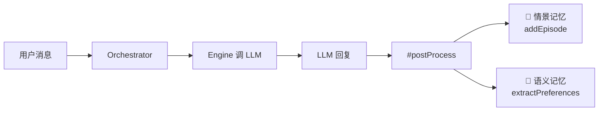

# Muse 记忆架构 — 调试分析文档

> ⚠️ **本文档定位**：T07 Web 驾驶舱调试时的分析笔记，非权威架构规范。
> 正式记忆架构方案见 [phase2/README.md §3.1](../../../phase2/README.md)，当前实现见 [phase1/README.md T04](../README.md)。

---

## 1. 测试为什么没发现这个问题？

### 根因分析

```
测试层                    真实运行
────────────              ────────────
mock.listMemories()       semantic_memory 表: 0 条  ← 空!
  → 返回 [{key:'lang'...}]   
mock.getRecentEpisodes()  episodic_memory 表: 26 条 ← 有数据!
  → 返回 [{id:1...}]
```

| 测试盲区 | 原因 |
|----------|------|
| **Mock 均返回数据** | 两种记忆的 mock 都硬编码了返回值，掩盖了"语义=空、情景=有"的真实分布 |
| **没测 HTML 默认 tab** | API 测试只验证路由返回格式，不验证前端哪个 tab 是默认激活的 |
| **没测"空数据"场景** | 测试从未验证 `listMemories()` 返回空数组时，前端和 API 的行为 |

### 本质

这不是 API bug，而是 **UX 假设错误** + **测试未覆盖真实数据分布**。

## 2. 语义记忆 vs 情景记忆



| | 语义记忆 Semantic | 情景记忆 Episodic |
|---|---|---|
| **类比** | 长期知识（"Later 喜欢 ESM"） | 日记本（每句对话） |
| **存储** | KV 对，相同 key 会覆盖 | 按时间追加，不覆盖 |
| **写入时机** | 正则提取偏好（`喜欢X`/`偏好X`） | 每轮对话自动存 user+assistant |
| **当前状态** | **0 条**（正则模式很少命中） | **26 条**（今天的对话） |
| **查询** | 关键词搜索 key+value | 按天数查最近 / 关键词搜索 content |

### 为什么语义记忆是 0？

当前 Orchestrator 只通过**正则**提取偏好：

```javascript
// orchestrator.mjs #extractPreferences()
PREFERENCE_PATTERNS = [
  { regex: /我喜欢(.+)/,   key: 'preference_like', category: 'preference' },
  { regex: /我偏好(.+)/,   key: 'preference_style', category: 'preference' },
  // ...
]
```

如果对话中没说"我喜欢XX"这样的句式，就不会写入语义记忆。

## 3. 当前架构 (Phase 1)

```
┌─────────────────────────────────────────────────────────┐
│                    SQLite (memory.db)                     │
│                                                          │
│  ┌──────────────────┐    ┌──────────────────────────┐   │
│  │ semantic_memory   │    │ episodic_memory           │   │
│  │ (KV, 自动去重)    │    │ (时间序列, 按 session 分组) │   │
│  └────────┬─────────┘    └──────────┬───────────────┘   │
│           │ setMemory()             │ addEpisode()       │
└───────────┼─────────────────────────┼───────────────────┘
            │                         │
   ┌────────┴─────────────────────────┴────────┐
   │            Orchestrator.#postProcess()      │
   │  [a] addEpisode(user)    ← 每轮必存        │
   │  [b] addEpisode(assistant) ← 每轮必存      │
   │  [c] extractPreferences()  ← 正则命中才存  │
   └────────────────────────────────────────────┘
```

## 4. Phase 2 演进方向

> 以下对齐 [phase2/README.md](../../../phase2/README.md) 正式方案。

| 增强方向 | 说明 |
|----------|------|
| **AI 自主记忆** | 通过 Memory MCP Server，AI 在对话中自主调用 `set_memory` 存储偏好，替代正则提取（详见 phase2/README.md §3.1） |
| **会话级摘要** | 对话结束后，AI 自主调用 `add_episode` 生成摘要 |
| **向量检索** | sqlite-vec 扩展，在现有 SQLite 内实现 embedding 相似度搜索（P2-08） |
| **跨会话上下文** | 小缪能主动引用过去的对话（"你上次说压力大，现在好些了吗？"） |
| **记忆整理** | 小脑定时触发背景 Session，AI 自主整理/合并/清理记忆（P2-09） |
