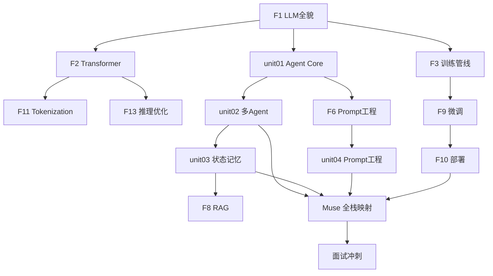

# 30 天学习大纲 — AI Agent 技术大佬修炼路线

> **总目标：** 30 天后 → AI Agent + 模型部署的技术大佬，面试随便聊
> **核心原则：** 每天 1 小时 × 10 倍放大 = 300 小时的知识密度
> **回看机制：** 大纲先立骨架，内容按任务填充，随时回来复习
> **允许延期，不允许偏离目标。核心内容不遗漏！**

---

## 全局知识地图 — 从理论到工程

```
Week 1: 大模型是什么 ──────────────────────── 理论根基
  ├─ LLM 本质 (token 预测 + 两个文件)
  ├─ Transformer 架构 (Attention + QKV)
  ├─ 训练管线 (预训练 → SFT → RLHF/DPO)
  └─ 工程基础 (Tokenization + 推理优化)

Week 2: Agent 是什么 ──────────────────────── 核心能力
  ├─ Agent 循环 (Reason → Act → Observe)
  ├─ 5 种编排模式 (Chain/Route/Parallel/Orch/Eval)
  ├─ Tool Use + ACI 设计
  └─ Prompt 工程 (7 层 + 技巧)

Week 3: 多 Agent + 工程化 ─────────────────── 系统设计
  ├─ 多 Agent 协作 (Handoff + Eval)
  ├─ 状态 + 记忆 (短期/长期/向量)
  ├─ RAG (检索增强)
  └─ 微调 + 部署 (LoRA/量化/Ollama)

Week 4: 综合实战 + 面试 ───────────────────── 融会贯通
  ├─ 项目拆解 (Claude Code/Aider/Swarm)
  ├─ Muse 架构映射
  ├─ 评估体系 (SWE-bench/Eval)
  └─ 面试冲刺 (全覆盖)
```

---

## Week 1: 大模型基础 (Day 1-7)

> **目标：** 彻底理解"大模型是什么，怎么来的，怎么思考"
> **来源底子：** [B1] Raschka + [C1-C4] Karpathy + [U4] MIT 6.S191

### Day 1-2: LLM 全貌

| 内容 | 对应文档 | 来源 | 状态 |
|------|---------|------|------|
| LLM = 两个文件 + next-token prediction | `F1-llm-intro.md` §1 | [C1] Karpathy + [B1] ch01 | ✅ 已写 |
| 训练三阶段 (Pre→SFT→RLHF) | `F1-llm-intro.md` §2 | [C3] State of GPT + [P3] InstructGPT | ✅ 已写 |
| 发展脉络 (GPT-1→DeepSeek R1→o1) | `F1-llm-intro.md` §3 | [P2] Scaling Laws + [P5] R1 | ✅ 已写 |
| CoT + GRPO + 思考机制 | `F1-llm-intro.md` §4 | [P5] DeepSeek R1 §2.2 + [W6] Mini-R1 | ✅ 已写 |

### Day 3-4: Transformer 架构

| 内容 | 对应文档 | 来源 | 状态 |
|------|---------|------|------|
| Self-Attention 数学 (QKV) | `F2-build-gpt.md` | [W1] Alammar + [B1] ch03 | [TODO] 待重写 |
| Multi-Head Attention | `F2-build-gpt.md` | [P1] Attention 论文 + [B1] ch03 | [TODO] |
| 完整 GPT 架构 (model.py 走读) | `F2-build-gpt.md` | `repos/nanoGPT/model.py` [G1] | [TODO] |
| 位置编码 + Embedding | `F2-build-gpt.md` | [B1] ch02 | [TODO] |

### Day 5: 训练管线

| 内容 | 对应文档 | 来源 | 状态 |
|------|---------|------|------|
| 预训练完整流程 | `F3-state-of-gpt.md` | [C3] Karpathy + [B1] ch05 | [TODO] 待重写 |
| SFT 对话格式 | `F3-state-of-gpt.md` | [B1] ch07 + [P3] InstructGPT | [TODO] |
| RLHF → DPO 演进 | `F3-state-of-gpt.md` | [B1] ch07/04_dpo + [U5] CS285 | [TODO] |

### Day 6: Tokenization + 推理优化

| 内容 | 对应文档 | 来源 | 状态 |
|------|---------|------|------|
| BPE 算法原理 + 实现 | `F11-tokenization.md` | `repos/minbpe/` [G2] + [C4] Karpathy | [TODO] 待重写 |
| KV-Cache + Flash Attention | `F13-inference-optimization.md` | [B1] ch04/03_kv-cache + [P10] | [TODO] 待重写 |

### Day 7: Week 1 复习 + 神经网络直觉

| 内容 | 对应文档 | 来源 | 状态 |
|------|---------|------|------|
| 3B1B 可视化理解 | `F5-neural-net-viz.md` | [C5] 3Blue1Brown | [TODO] 轻量 |
| **Week 1 面试卡片** | `review/week1-cards.md` | 汇总 | [ ] |

---

## Week 2: Agent 核心 (Day 8-14)

> **目标：** 彻底理解"Agent 是什么，怎么工作，怎么设计"
> **来源底子：** [W5] BEA + [W4] Weng + [P6] ReAct + [U2] Berkeley CS294
> **对应：** unit01 + unit04

### Day 8-9: Agent 循环 + 编排模式 → unit01

| 内容 | OC 任务 (USOLB) | 状态 |
|------|----------------|------|
| Agent vs Workflow 区分 | study 01a ✅ | ✅ |
| 5 种编排模式 | study 01a ✅ | ✅ |
| ACI + Poka-yoke | study 01a ✅ | ✅ |
| ReAct 循环 + Weng 三要素 | study 01e ✅ | ✅ |
| **oc01** 启动 Muse + 看日志 | `[U][L]` | [ ] |
| **oc02** trace-reader 全链路 | `[U][L]` | [ ] |
| **oc03** event hook 观察 Agent Loop | `[O][L]` | [ ] |

### Day 10-11: 源码理解 + 工具设计 → unit01

| 内容 | OC 任务 (USOLB) | 状态 |
|------|----------------|------|
| Cookbook 代码精读 | study 01c ✅ | ✅ |
| 开源项目分析 + 面试 | study 01b ✅ | ✅ |
| **oc04** 走读 OC Session 源码 | `[S]` | [ ] |
| **oc05** 走读 Muse 调用链 | `[S]` | [ ] |
| **oc06** ACI 审计 MCP 工具 | `[S][B]` | [ ] |

### Day 12-13: Prompt 工程 → unit04

| 内容 | OC 任务 (USOLB) | 状态 |
|------|----------------|------|
| Zero/Few-Shot + CoT + ToT | study 04a [TODO] | [ ] |
| System Prompt 设计 | study 04b [TODO] | [ ] |
| **oc27** 参数实验 | `[U][B]` | [ ] |
| **oc28** 观察 Prompt 注入链 | `[O]` | [ ] |
| **oc29** 走读 Prompt 组装链 | `[S]` | [ ] |

### Day 14: Week 2 复习 + 创造

| 内容 | OC 任务 (USOLB) | 状态 |
|------|----------------|------|
| **oc07** Prompt 注入链走读 | `[S][O]` | [ ] |
| **oc08** 写新 MCP 工具 | `[B][U]` | [ ] |
| **oc09** 落地 ACI 修复 | `[B]` | [ ] |
| **Week 2 面试卡片** | `review/week2-cards.md` | [ ] |

---

## Week 3: 多 Agent + 工程化 (Day 15-21)

> **目标：** 理解"多个 Agent 怎么协作，状态怎么管理，微调/部署"
> **来源底子：** [G6] Swarm + [C8] MS Agents + [B1] ch06-07 + [U6] HuggingFace
> **对应：** unit02 + unit03

### Day 15-16: 多 Agent 协作 → unit02

| 内容 | OC 任务 (USOLB) | 状态 |
|------|----------------|------|
| Orchestrator-Workers 深入 | study 02a [TODO] | [ ] |
| Swarm Handoff 机制 | study 02b [TODO] | [ ] |
| **oc12** 触发 Muse Harness | `[U][L]` | [ ] |
| **oc13** Swarm 跑通官方 demo | `[U]` | [ ] |
| **oc14** 走读 Harness 三件套 | `[S]` | [ ] |
| **oc15** 走读 Swarm core.py | `[S]` | [ ] |

### Day 17-18: 状态 + 记忆 → unit03

| 内容 | OC 任务 (USOLB) | 状态 |
|------|----------------|------|
| 记忆三分类 + 向量嵌入 | study 03a [TODO] | [ ] |
| Compaction 策略 | study 03b [TODO] | [ ] |
| **oc20** 观察 Muse Memory 读写 | `[U][L]` | [ ] |
| **oc21** 触发 Compaction | `[U][O][L]` | [ ] |
| **oc22** 走读 memory.mjs 源码 | `[S]` | [ ] |
| **oc23** 走读 OC Compaction | `[S]` | [ ] |

### Day 19-20: 微调 + 部署

| 内容 | 对应文档 | 来源 | 状态 |
|------|---------|------|------|
| LoRA/QLoRA 原理 | `F9-distill-finetune.md` | [P7] LoRA + [P8] QLoRA + [B1] ch06-07 | [TODO] |
| GGUF/量化/Ollama 部署 | `F10-local-deploy.md` | [W8] 量化可视化 | [TODO] |
| RAG 架构和原理 | `F8-rag.md` | [P9] RAG 论文 | [TODO] |

### Day 21: Week 3 复习 + 分析/创造

| 内容 | OC 任务 (USOLB) | 状态 |
|------|----------------|------|
| **oc16** Harness vs BEA 审计 | `[S]` | [ ] |
| **oc17** 评估框架设计 | `[S][B]` | [ ] |
| **oc24** Memory 审计 | `[S][B]` | [ ] |
| **Week 3 面试卡片** | `review/week3-cards.md` | [ ] |

---

## Week 4: 综合实战 + 面试冲刺 (Day 22-30)

> **目标：** 项目拆解验证理论，Muse 映射贯通全栈，面试准备覆盖

### Day 22-23: 创造 — 实际改进 Muse

| 内容 | OC 任务 (USOLB) | 状态 |
|------|----------------|------|
| **oc18** 改进 Muse Handoff | `[B]` | [ ] |
| **oc25** 改进 Memory | `[B]` | [ ] |
| **oc31** 优化 Persona Prompt | `[B][U]` | [ ] |

### Day 24-25: 综合分析 + 对比

| 内容 | OC 任务 (USOLB) | 状态 |
|------|----------------|------|
| **oc10** Claude Code/Aider/OC Agent Loop 对比 | `[S]` | [ ] |
| **oc30** System Prompt 三方对比 | `[S]` | [ ] |
| 评测基准 (MMLU/Arena/SWE-bench) | `F12-eval-benchmarks.md` [TODO] 轻量 | [ ] |

### Day 26-27: Muse 全栈映射

| 内容 | 对应文档 | 状态 |
|------|---------|------|
| Muse 架构 vs 30 天知识的映射 | `review/muse-mapping.md` | [ ] |
| 学习助手架构总结 | `projects/learning-assistant/` | [ ] |

### Day 28-30: 面试冲刺

| 内容 | OC 任务 | 状态 |
|------|--------|------|
| **oc11** unit01 面试故事 | — | [ ] |
| **oc19** unit02 面试故事 | — | [ ] |
| **oc26** unit03 面试故事 | — | [ ] |
| **oc32** unit04 面试故事 | — | [ ] |
| **全覆盖面试题库 (50+)** | `review/interview-master.md` | [ ] |

---

## OC 任务全景汇总

| Unit | OC 编号 | 数量 | Bloom 覆盖 |
|------|--------|------|-----------|
| unit01 Agent Core | oc01-oc11 | 11 个 | L1-L5 全覆盖 |
| unit02 多 Agent | oc12-oc19 | 8 个 | L1-L5 全覆盖 |
| unit03 状态记忆 | oc20-oc26 | 7 个 | L1-L5 全覆盖 |
| unit04 Prompt | oc27-oc32 | 6 个 | L1-L5 全覆盖 |
| **总计** | — | **32 个** | — |

## Muse 里程碑全景

| # | 里程碑 | 对应 Unit | 状态 |
|---|--------|----------|------|
| M1 | 理解 Muse 全调用链 | unit01 | [ ] |
| M2 | ACI 审计 → 落地修复 | unit01 | [ ] |
| M3 | 新增 MCP 工具 | unit01 | [ ] |
| M4 | 可观测性增强 | unit01 | [ ] |
| M5 | Harness 编排流程图 | unit02 | [ ] |
| M6 | Harness 审计 + 改进 | unit02 | [ ] |
| M7 | Handoff 超时修复 | unit02 | [ ] |
| M8 | Memory 架构理解 | unit03 | [ ] |
| M9 | Memory 审计 + 改进 | unit03 | [ ] |
| M10 | Prompt 注入链理解 | unit04 | [ ] |
| M11 | Persona Prompt 改好 | unit04 | [ ] |

## 学习助手里程碑全景

| # | 版本 | 对应 Unit | 状态 |
|---|------|----------|------|
| S1 | Agent Loop 设计 | unit01 | [ ] |
| S2 | 工具清单 (ACI) | unit01 | [ ] |
| S3 | V0 可跑 demo | unit01 | [/] |
| S4 | V1 多轮对话 | unit02 | [ ] |
| S5 | V2 带记忆 | unit03 | [ ] |
| S6 | V3 高质量 Prompt | unit04 | [ ] |

---

## 知识依赖图



---

## 文档清单 — 框架占位

### foundations/ (15 个 F 文档)

| 文档 | 状态 | Week | 来源底子 |
|------|------|------|---------|
| F1-llm-intro.md | ✅ 已完成 | W1 | [C1][B1][P5] |
| F2-build-gpt.md | [占位] 待重写 | W1 | [W1][B1 ch03][G1] |
| F3-state-of-gpt.md | [占位] 待重写 | W1 | [C3][B1 ch05-07][P3] |
| F5-neural-net-viz.md | [占位] 轻量 | W1 | [C5] |
| F6-prompt-eng.md | [占位] 待重写 | W2 | [G16][W9][C6] |
| F7-llm-systems.md | [占位] 轻量 | W4 | [D4] |
| F8-rag.md | [占位] 待重写 | W3 | [P9][D1] |
| F9-distill-finetune.md | [占位] 待重写 | W3 | [P7][P8][B1 ch06-07][U6] |
| F10-local-deploy.md | [占位] 待重写 | W3 | [W8][G4] |
| F11-tokenization.md | [占位] 待重写 | W1 | [G2][C4] |
| F12-eval-benchmarks.md | [占位] 轻量 | W4 | 在线 |
| F13-inference-optimization.md | [占位] 待重写 | W1 | [P10][B1 ch04] |
| F14-multimodal.md | [占位] 低优 | — | — |
| F15-ai-safety.md | [占位] 轻量 | W4 | 在线 |

### unit study docs (4 个 unit)

| Unit | study 文档 | 状态 | Week |
|------|-----------|------|------|
| **unit01** | 01a BEA + 01b Projects + 01c Cookbook + 01e ReAct+Weng | ✅ 已升级 | W2 |
| **unit02** | 02a Orchestrator + 02b Swarm + 02c 评估 | [占位] | W3 |
| **unit03** | 03a Memory + 03b 状态机 | [占位] | W3 |
| **unit04** | 04a 7层Prompt + 04b System Prompt | [占位] | W2 |

### review/ (复习 + 面试)

| 文档 | 内容 | 状态 |
|------|------|------|
| week1-cards.md | Week 1 核心概念面试卡片 | [占位] |
| week2-cards.md | Week 2 Agent 面试卡片 | [占位] |
| week3-cards.md | Week 3 工程化面试卡片 | [占位] |
| interview-master.md | 全覆盖面试题库 (50 题) | [占位] |
| muse-mapping.md | Muse 全栈知识映射 | [占位] |

---

## 进度追踪

```
Week 1: [■■□□□□□] 2/7
Week 2: [■■■■■□□] 5/7 (unit01 study 已完成)
Week 3: [□□□□□□□] 0/7
Week 4: [□□□□□□□□□] 0/9
总进度: 7/30 days (23%)
```
