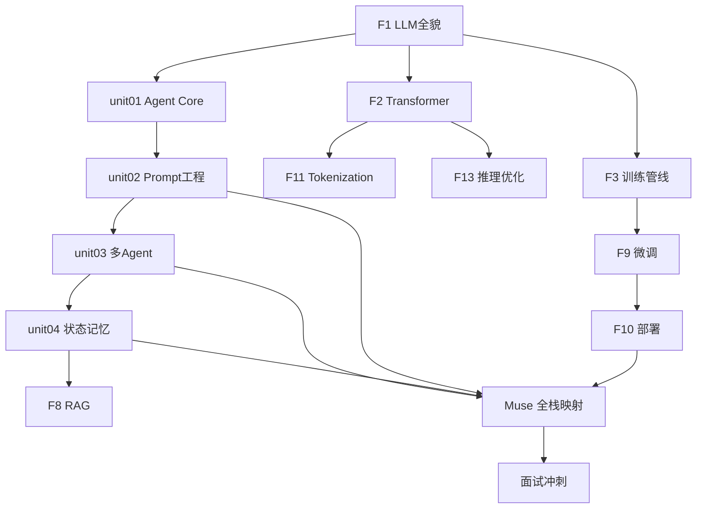

# 30 天学习大纲 — AI Agent 技术大佬修炼路线

> **总目标：** 30 天后 → AI Agent + 模型部署的技术大佬，面试随便聊
> **核心原则：** 每天 1 小时 × 10 倍放大 = 300 小时的知识密度
> **排序依据：** hello-agents[G7] / Berkeley CS294[U2] / MS C8 / BEA[W5] / Weng[W4] 的教学顺序
> **允许延期，不允许偏离目标。核心内容不遗漏！**

---

## 参考课程路线对照

```
hello-agents [G7]:   Agent基础 → Prompt工程 → Multi-Agent → Memory
Berkeley [U2]:       Reasoning → Agent → ToolUse → RAG → Multi-Agent
MS C8:               Intro → Patterns → ToolUse → RAG → Planning → Multi-Agent → Memory
Weng [W4]:          Planning(含Prompt) → Memory → Tools  (三要素)
BEA [W5]:           单Agent模式 → Orchestrator → Evaluator

→ 我们的顺序:  foundations → unit01(Agent) → unit02(Prompt) → unit03(Multi-Agent) → unit04(Memory)
```

---

## 全局知识地图

```
Week 1: 大模型是什么 ──────────────────────── 理论根基
  ├─ LLM 本质 (token 预测 + 两个文件)
  ├─ Transformer 架构 (Attention + QKV)
  ├─ 训练管线 (预训练 → SFT → RLHF/DPO)
  └─ 工程基础 (Tokenization + 推理优化)

Week 2: Agent + Prompt ────────────────────── 核心能力
  ├─ Agent 循环 (Reason → Act → Observe)
  ├─ 5 种编排模式 + Tool Use + ACI
  ├─ 7 层 Prompt 架构 + 参数调优
  └─ System Prompt 设计 + Muse Persona

Week 3: 多 Agent + 记忆 ───────────────────── 系统设计
  ├─ 多 Agent 协作 (Handoff + Eval)
  ├─ Muse Harness 编排
  ├─ 状态 + 记忆 (短期/长期/向量)
  └─ Compaction + RAG

Week 4: 综合实战 + 面试 ───────────────────── 融会贯通
  ├─ 项目拆解 (Claude Code/Aider/Swarm)
  ├─ Muse 全栈映射
  ├─ 微调 + 部署 (LoRA/量化/Ollama)
  └─ 面试冲刺 (全覆盖)
```

---

## Week 1: 大模型基础 (Day 1-7)

> **目标：** 彻底理解"大模型是什么，怎么来的，怎么思考"
> **来源底子：** [B1] Raschka + [C1-C4] Karpathy + [U4] MIT 6.S191

### Day 1-2: LLM 全貌

| 内容 | 对应文档 | 来源 | 状态 |
|------|---------|------|------|
| LLM = 两个文件 + next-token prediction | `F1-llm-intro.md` §1 | [C1] Karpathy + [B1] ch01 | ✅ 已写 |
| 训练三阶段 (Pre→SFT→RLHF) | `F1-llm-intro.md` §2 | [C3] State of GPT + [P3] InstructGPT | ✅ 已写 |
| 发展脉络 (GPT-1→DeepSeek R1→o1) | `F1-llm-intro.md` §3 | [P2] Scaling Laws + [P5] R1 | ✅ 已写 |
| CoT + GRPO + 思考机制 | `F1-llm-intro.md` §4 | [P5] DeepSeek R1 §2.2 + [W6] Mini-R1 | ✅ 已写 |

### Day 3-4: Transformer 架构

| 内容 | 对应文档 | 来源 | 状态 |
|------|---------|------|------|
| Self-Attention 数学 (QKV) | `F2-build-gpt.md` | [W1] Alammar + [B1] ch03 | [TODO] 待重写 |
| 完整 GPT 架构 | `F2-build-gpt.md` | `repos/nanoGPT/model.py` [G1] | [TODO] |

### Day 5: 训练管线

| 内容 | 对应文档 | 来源 | 状态 |
|------|---------|------|------|
| 预训练 + SFT + RLHF→DPO | `F3-state-of-gpt.md` | [C3] + [B1] ch05-07 + [P3] | [TODO] 待重写 |

### Day 6: Tokenization + 推理优化

| 内容 | 对应文档 | 来源 | 状态 |
|------|---------|------|------|
| BPE 算法 | `F11-tokenization.md` | `repos/minbpe/` [G2] + [C4] | [TODO] |
| KV-Cache + Flash Attention | `F13-inference-optimization.md` | [B1] ch04 + [P10] | [TODO] |

### Day 7: 复习

| 内容 | 状态 |
|------|------|
| **Week 1 面试卡片** | [ ] |

---

## Week 2: Agent 核心 + Prompt (Day 8-14)

> **目标：** 彻底理解 Agent 循环 + 写好 Prompt
> **来源底子：** [W5] BEA + [W4] Weng + [P6] ReAct + [G16] Prompt Guide
> **对应：** unit01 + unit02
> **排序逻辑：** Prompt 在 Multi-Agent 前面 (hello-agents ch5-6 → ch7-8)

### Day 8-10: Agent 核心循环 → unit01 (oc01-11)

| 内容 | OC 任务 (USOLB) | 状态 |
|------|----------------|------|
| Agent vs Workflow + 5 种编排 + ACI | study 01a ✅ | ✅ |
| ReAct 循环 + Weng 三要素 | study 01e ✅ | ✅ |
| **oc01** 启动 Muse + 看日志 | `[U][L]` | [AI✓] |
| **oc02** trace-reader 全链路 | `[U][L]` | [AI✓] |
| **oc03** event hook 观察 Agent Loop | `[O][L]` | [AI✓] |
| **oc04** 走读 OC Session 源码 | `[S]` | [AI✓] |
| **oc05** 走读 Muse 调用链 | `[S]` | [AI✓] |
| **oc06** ACI 审计 MCP 工具 | `[S][B]` | [AI✓] |
| **oc07** Prompt 注入链走读 | `[S][O]` | [AI✓] |
| **oc08** 写新 MCP 工具 | `[B][U]` | [ ] |
| **oc09** 落地 ACI 修复 | `[B]` | [ ] |
| **oc10** 三 Agent Loop 对比 | `[S]` | [AI✓] |
| **oc11** 面试 STAR 故事 | — | [AI✓] |

### Day 11-13: Prompt 工程 → unit02 (oc12-17)

| 内容 | OC 任务 (USOLB) | 状态 |
|------|----------------|------|
| 7 层 Prompt + 参数 + CoT/ToT | study 04a [TODO] | [ ] |
| System Prompt 设计 | study 04b [TODO] | [ ] |
| **oc12** 参数实验 (temperature) | `[U][B]` | [ ] |
| **oc13** 观察 Prompt 注入链 | `[O]` | [ ] |
| **oc14** 走读 Prompt 组装链 | `[S]` | [ ] |
| **oc15** 三方 System Prompt 对比 | `[S]` | [ ] |
| **oc16** 优化 Muse Persona | `[B][U]` | [ ] |
| **oc17** 面试 STAR 故事 | — | [ ] |

### Day 14: Week 2 复习

| 内容 | 状态 |
|------|------|
| **Week 2 面试卡片** | [ ] |

---

## Week 3: 多 Agent + 记忆 (Day 15-21)

> **目标：** 理解多 Agent 协作 + 记忆工程
> **来源底子：** [G6] Swarm + [C8] MS Agents + [W4] Weng Memory + [D3] LangGraph
> **对应：** unit03 + unit04
> **排序逻辑：** Multi-Agent 再 Memory (C8 L8→L13; Berkeley U2 先Multi-Agent后Retrieval)

### Day 15-17: 多 Agent 协作 → unit03 (oc18-25)

| 内容 | OC 任务 (USOLB) | 状态 |
|------|----------------|------|
| Orchestrator-Workers 深入 | study 02a [TODO] | [ ] |
| Swarm Handoff 机制 | study 02b [TODO] | [ ] |
| **oc18** 触发 Muse Harness | `[U][L]` | [ ] |
| **oc19** Swarm 跑通官方 demo | `[U]` | [ ] |
| **oc20** 走读 Harness 三件套 | `[S]` | [ ] |
| **oc21** 走读 Swarm core.py | `[S]` | [ ] |
| **oc22** Harness vs BEA 审计 | `[S]` | [ ] |
| **oc23** 评估框架设计 | `[S][B]` | [ ] |
| **oc24** 改进 Handoff | `[B]` | [ ] |
| **oc25** 面试 STAR 故事 | — | [ ] |

### Day 18-20: 状态 + 记忆 → unit04 (oc26-32)

| 内容 | OC 任务 (USOLB) | 状态 |
|------|----------------|------|
| 记忆三分类 + 向量嵌入 | study 03a [TODO] | [ ] |
| Compaction 策略 | study 03b [TODO] | [ ] |
| **oc26** 观察 Muse Memory 读写 | `[U][L]` | [ ] |
| **oc27** 触发 Compaction | `[U][O][L]` | [ ] |
| **oc28** 走读 memory.mjs 源码 | `[S]` | [ ] |
| **oc29** 走读 OC Compaction | `[S]` | [ ] |
| **oc30** Memory 审计 | `[S][B]` | [ ] |
| **oc31** 改进 Memory | `[B]` | [ ] |
| **oc32** 面试 STAR 故事 | — | [ ] |

### Day 21: 复习 + 微调/部署

| 内容 | 对应文档 | 来源 | 状态 |
|------|---------|------|------|
| LoRA/QLoRA 原理 | `F9-distill-finetune.md` | [P7] + [P8] + [B1] ch06-07 | [TODO] |
| GGUF/量化/Ollama 部署 | `F10-local-deploy.md` | [W8] | [TODO] |
| RAG 架构 | `F8-rag.md` | [P9] | [TODO] |
| **Week 3 面试卡片** | | | [ ] |

---

## Week 4: 综合 + 面试 (Day 22-30)

### Day 22-24: Muse 改进落地

| OC 任务 | 状态 |
|--------|------|
| 落地 ACI 修复 (oc09) | [ ] |
| 改进 Handoff (oc24) | [ ] |
| 改进 Memory (oc31) | [ ] |
| 优化 Persona Prompt (oc16) | [ ] |

### Day 25-27: 综合分析 + 映射

| 内容 | 状态 |
|------|------|
| 三 Agent Loop 对比 (oc10) | [ ] |
| 三方 System Prompt 对比 (oc15) | [ ] |
| Muse 全栈知识映射 | [ ] |
| 评测基准 (F12 轻量) | [ ] |

### Day 28-30: 面试冲刺

| OC 任务 | 状态 |
|--------|------|
| oc11 unit01 面试故事 | [ ] |
| oc17 unit02 面试故事 | [ ] |
| oc25 unit03 面试故事 | [ ] |
| oc32 unit04 面试故事 | [ ] |
| **全覆盖面试题库 (50+)** | [ ] |

---

## 全景汇总

### 🔧 OC 小任务（纯学习，在 unit/oc-tasks/）

| Unit | OC 编号 | 数量 | Bloom 层 | 位置 |
|------|--------|------|---------|------|
| unit01 Agent Core | oc01-07, oc10-11 | 9 个 | L1-L3, L5 | `unit01/oc-tasks/` |
| unit02 Prompt Eng | oc12-15, oc17 | 5 个 | L1-L3, L5 | `unit02/oc-tasks/` |
| unit03 多 Agent | oc18-23, oc25 | 7 个 | L1-L3, L5 | `unit03/oc-tasks/` |
| unit04 状态记忆 | oc26-30, oc32 | 6 个 | L1-L3, L5 | `unit04/oc-tasks/` |
| **小计** | — | **27 个** | — | — |

### 🏗️ 主线 Muse 改进任务（在 projects/muse-milestones/）

| OC 编号 | 任务 | 来自 Unit | 位置 |
|--------|------|----------|------|
| oc08 | 写新 MCP 工具 | unit01 | `projects/muse-milestones/unit01/` |
| oc09 | ACI 落地修复 | unit01 | `projects/muse-milestones/unit01/` |
| oc16 | Persona Prompt 改进 | unit02 | `projects/muse-milestones/unit02/` |
| oc24 | Handoff 超时修复 | unit03 | `projects/muse-milestones/unit03/` |
| oc31 | Memory 改进 | unit04 | `projects/muse-milestones/unit04/` |
| **小计** | — | — | **5 个** |

> **合计 32 个任务 = 27 个 OC 学习 + 5 个 Muse 项目**

### Muse 里程碑（OC 学习 → 项目实践的映射）

| # | 里程碑 | 触发 OC | 类型 |
|---|--------|--------|------|
| M1 | 理解 Muse 全调用链 | oc05 走读 | 🔧 学习产出 |
| M2 | ACI 审计 → 落地修复 | oc06→**oc09** | 🏗️ 改代码 |
| M3 | 新增 MCP 工具 | **oc08** | 🏗️ 改代码 |
| M4 | 可观测性增强 | oc03 hook | 🔧 学习产出 |
| M5 | Prompt 注入链理解 | oc14 走读 | 🔧 学习产出 |
| M6 | Persona Prompt 改好 | **oc16** | 🏗️ 改代码 |
| M7 | Harness 编排流程图 | oc20 走读 | 🔧 学习产出 |
| M8 | Harness 审计 + 改进 | oc22→**oc24** | 🏗️ 改代码 |
| M9 | Handoff 超时修复 | **oc24** | 🏗️ 改代码 |
| M10 | Memory 架构理解 | oc28 走读 | 🔧 学习产出 |
| M11 | Memory 审计 + 改进 | oc30→**oc31** | 🏗️ 改代码 |

### 学习助手里程碑

| # | 版本 | 对应 Unit |
|---|------|----------|
| S1 | Agent Loop 设计 | unit01 |
| S2 | 工具清单 (ACI) | unit01 |
| S3 | V0 可跑 demo | unit01 |
| S4 | V1 高质量 Prompt | unit02 |
| S5 | V2 多轮对话 | unit03 |
| S6 | V3 带记忆 | unit04 |

---

## 知识依赖图


