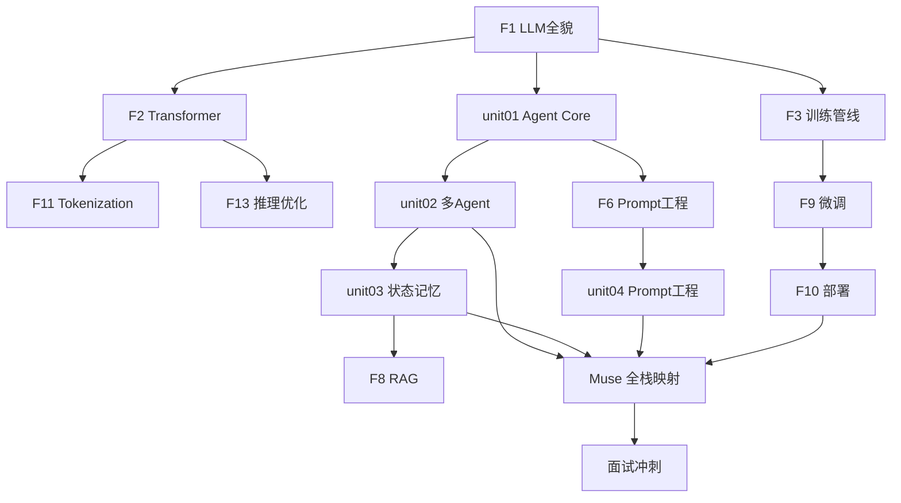

# 30 天学习大纲 — AI Agent 技术大佬修炼路线

> **总目标：** 30 天后 → AI Agent + 模型部署的技术大佬，面试随便聊
> **核心原则：** 每天 1 小时 × 10 倍放大 = 300 小时的知识密度
> **回看机制：** 大纲先立骨架，内容按任务填充，随时回来复习

---

## 全局知识地图 — 从理论到工程

```
Week 1: 大模型是什么 ──────────────────────── 理论根基
  ├─ LLM 本质 (token 预测 + 两个文件)
  ├─ Transformer 架构 (Attention + QKV)
  ├─ 训练管线 (预训练 → SFT → RLHF/DPO)
  └─ 工程基础 (Tokenization + 推理优化)

Week 2: Agent 是什么 ──────────────────────── 核心能力
  ├─ Agent 循环 (Reason → Act → Observe)
  ├─ 5 种编排模式 (Chain/Route/Parallel/Orch/Eval)
  ├─ Tool Use + ACI 设计
  └─ Prompt 工程 (7 层 + 技巧)

Week 3: 多 Agent + 工程化 ─────────────────── 系统设计
  ├─ 多 Agent 协作 (Handoff + Eval)
  ├─ 状态 + 记忆 (短期/长期/向量)
  ├─ RAG (检索增强)
  └─ 微调 + 部署 (LoRA/量化/Ollama)

Week 4: 综合实战 + 面试 ───────────────────── 融会贯通
  ├─ 项目拆解 (Claude Code/Aider/Swarm)
  ├─ Muse 架构映射
  ├─ 评估体系 (SWE-bench/Eval)
  └─ 面试冲刺 (全覆盖)
```

---

## Week 1: 大模型基础 (Day 1-7)

> **目标：** 彻底理解"大模型是什么，怎么来的，怎么思考"
> **来源底子：** [B1] Raschka + [C1-C4] Karpathy + [U4] MIT 6.S191

### Day 1-2: LLM 全貌

| 内容 | 对应文档 | 来源 | 状态 |
|------|---------|------|------|
| LLM = 两个文件 + next-token prediction | `F1-llm-intro.md` §1 | [C1] Karpathy + [B1] ch01 | ✅ 已写 |
| 训练三阶段 (Pre→SFT→RLHF) | `F1-llm-intro.md` §2 | [C3] State of GPT + [P3] InstructGPT | ✅ 已写 |
| 发展脉络 (GPT-1→DeepSeek R1→o1) | `F1-llm-intro.md` §3 | [P2] Scaling Laws + [P5] R1 | ✅ 已写 |
| CoT + GRPO + 思考机制 | `F1-llm-intro.md` §4 | [P5] DeepSeek R1 §2.2 + [W6] Mini-R1 | ✅ 已写 |
| **OC:** oc01 Agent Loop 基础 | `unit01/oc-tasks/` | — | [ ] |

### Day 3-4: Transformer 架构

| 内容 | 对应文档 | 来源 | 状态 |
|------|---------|------|------|
| Self-Attention 数学 (QKV) | `F2-build-gpt.md` | [W1] Alammar + [B1] ch03 | [TODO] 待重写 |
| Multi-Head Attention | `F2-build-gpt.md` | [P1] Attention 论文 + [B1] ch03 | [TODO] |
| 完整 GPT 架构 (model.py 走读) | `F2-build-gpt.md` | `repos/nanoGPT/model.py` [G1] | [TODO] |
| 位置编码 + Embedding | `F2-build-gpt.md` | [B1] ch02 | [TODO] |
| **OC:** 和 nanoGPT 对照理解 | — | `repos/nanoGPT/` | [ ] |

### Day 5: 训练管线

| 内容 | 对应文档 | 来源 | 状态 |
|------|---------|------|------|
| 预训练完整流程 | `F3-state-of-gpt.md` | [C3] Karpathy + [B1] ch05 | [TODO] 待重写 |
| SFT 对话格式 | `F3-state-of-gpt.md` | [B1] ch07 + [P3] InstructGPT | [TODO] |
| RLHF → DPO 演进 | `F3-state-of-gpt.md` | [B1] ch07/04_dpo + [U5] CS285 | [TODO] |

### Day 6: Tokenization + 推理优化

| 内容 | 对应文档 | 来源 | 状态 |
|------|---------|------|------|
| BPE 算法原理 + 实现 | `F11-tokenization.md` | `repos/minbpe/` [G2] + [C4] Karpathy | [TODO] 待重写 |
| KV-Cache + Flash Attention | `F13-inference-optimization.md` | [B1] ch04/03_kv-cache + [P10] | [TODO] 待重写 |

### Day 7: Week 1 复习 + 神经网络直觉

| 内容 | 对应文档 | 来源 | 状态 |
|------|---------|------|------|
| 3B1B 可视化理解 | `F5-neural-net-viz.md` | [C5] 3Blue1Brown | [TODO] 轻量 |
| **Week 1 面试卡片** | `review/week1-cards.md` | 汇总 | [ ] |

---

## Week 2: Agent 核心 (Day 8-14)

> **目标：** 彻底理解"Agent 是什么，怎么工作，怎么设计"
> **来源底子：** [W5] BEA + [W4] Weng + [P6] ReAct + [U2] Berkeley CS294

### Day 8-9: Agent 循环 + 编排模式

| 内容 | 对应文档 | 来源 | 状态 |
|------|---------|------|------|
| Agent vs Workflow 区分 | `unit01/study/01a` | [W5] BEA | ✅ 已写 |
| 5 种编排模式 | `unit01/study/01a` | [W5] BEA | ✅ 已写 |
| ACI + Poka-yoke | `unit01/study/01a` | [W5] BEA | ✅ 已写 |
| ReAct 循环 (Thought→Action→Obs) | `unit01/study/01e` | [P6] ReAct 论文 | ✅ 已写 |
| Weng 三要素 (Planning/Memory/Tools) | `unit01/study/01e` | [W4] Weng Blog | ✅ 已写 |
| **OC:** oc01 Agent Loop + oc02 Tool Use | `unit01/oc-tasks/` | — | [ ] |

### Day 10-11: 代码精读 + 项目分析

| 内容 | 对应文档 | 来源 | 状态 |
|------|---------|------|------|
| Cookbook 3 种基础模式代码 | `unit01/study/01c` | `repos/anthropic-cookbook/patterns/agents/` | ✅ 已写 |
| 开源项目映射 (Swarm/CrewAI/Clowder) | `unit01/study/01b` | `repos/swarm/` [G6] | ✅ 已写 |
| 面试准备 (基础+设计+故事题) | `unit01/study/01b` | — | ✅ 已写 |
| **OC:** oc03 编排模式对比 + oc04 Cookbook 复刻 | `unit01/oc-tasks/` | — | [ ] |

### Day 12-13: Prompt 工程

| 内容 | 对应文档 | 来源 | 状态 |
|------|---------|------|------|
| Zero/Few-Shot + CoT + ToT | `F6-prompt-eng.md` | `repos/Prompt-Engineering-Guide/` [G16] | [TODO] 待重写 |
| System Prompt 设计 | `F6-prompt-eng.md` | [W10] Anthropic + [W11] OpenAI | [TODO] |
| Prompt Injection 防御 | `F6-prompt-eng.md` | [G16] adversarial 章节 | [TODO] |
| **OC:** oc05 Hello-Agents Ch1-2 | `unit01/oc-tasks/` | `repos/hello-agents/` | [ ] |

### Day 14: Week 2 复习 + Berkeley 全景

| 内容 | 对应文档 | 来源 | 状态 |
|------|---------|------|------|
| Berkeley LLM Agents 概览 | 参考 slides | `repos/llm-agents-mooc/slides/intro.pdf` [U2] | [ ] |
| **Week 2 面试卡片** | `review/week2-cards.md` | 汇总 | [ ] |

---

## Week 3: 多 Agent + 工程化 (Day 15-21)

> **目标：** 理解"多个 Agent 怎么协作，状态怎么管理，RAG/微调/部署"
> **来源底子：** [G6] Swarm + [C8] MS Agents + [B1] ch06-07 + [U6] HuggingFace

### Day 15-16: 多 Agent 协作

| 内容 | 对应文档 | 来源 | 状态 |
|------|---------|------|------|
| Orchestrator-Workers 实现 | `unit02/study/02a` | `repos/anthropic-cookbook/patterns/agents/orchestrator_workers.ipynb` | [TODO] |
| Swarm Handoff 机制 (core.py 走读) | `unit02/study/02b` | `repos/swarm/swarm/core.py` [G6] | [TODO] |
| Agent 评估 (成功率/效率/成本) | `unit02/study/02c` | [D6] Eval 短课 | [TODO] |
| **OC:** oc06 MS Agents L1-3 + oc07 Claude Code 拆解 | — | `repos/ai-agents-for-beginners/` | [ ] |

### Day 17-18: 状态 + 记忆

| 内容 | 对应文档 | 来源 | 状态 |
|------|---------|------|------|
| 短期记忆 vs 长期记忆 | `unit03/study/03a` | [W4] Weng Memory + `repos/ai-agents-for-beginners/13-agent-memory/` | [TODO] |
| 向量嵌入 + 检索 (FAISS/HNSW) | `unit03/study/03a` | [B1] + `repos/anthropic-cookbook/capabilities/contextual-embeddings/` | [TODO] |
| RAG 架构和原理 | `F8-rag.md` | [P9] RAG 论文 + `repos/anthropic-cookbook/capabilities/retrieval_augmented_generation/` | [TODO] 待重写 |
| **OC:** oc08 Aider Git Agent 拆解 | — | — | [ ] |

### Day 19-20: 微调 + 部署

| 内容 | 对应文档 | 来源 | 状态 |
|------|---------|------|------|
| LoRA/QLoRA 原理 | `F9-distill-finetune.md` | [P7] LoRA + [P8] QLoRA + [B1] ch06-07 | [TODO] 待重写 |
| HuggingFace 微调实操 | `F9-distill-finetune.md` | `repos/huggingface-course/` [U6] + [D5] | [TODO] |
| GGUF/量化/Ollama 部署 | `F10-local-deploy.md` | [W8] 量化可视化 | [TODO] 待重写 |
| **OC:** oc09 OpenCode Session 走读 | — | KI: OpenCode 架构 | [ ] |

### Day 21: Week 3 复习

| 内容 | 对应文档 | 来源 | 状态 |
|------|---------|------|------|
| **Week 3 面试卡片** | `review/week3-cards.md` | 汇总 | [ ] |

---

## Week 4: 综合实战 + 面试冲刺 (Day 22-30)

> **目标：** 项目拆解验证理论，Muse 映射贯通全栈，面试准备覆盖
> **来源底子：** 全部 repos/ + 全部 study docs + Muse 源码

### Day 22-23: 项目拆解专项

| 内容 | 对应文档 | 来源 | 状态 |
|------|---------|------|------|
| Claude Code Agent Loop 拆解 | `unit01/oc-tasks/oc07` | 在线分析 | [TODO] |
| Aider Git 感知 Agent 拆解 | `unit01/oc-tasks/oc08` | `repos/aider/` (待 clone) | [TODO] |
| Swarm 完整源码走读 | `unit02/oc-tasks/` | `repos/swarm/` [G6] | [TODO] |

### Day 24-25: 评测 + AI Safety

| 内容 | 对应文档 | 来源 | 状态 |
|------|---------|------|------|
| 评测基准 (MMLU/Arena/SWE-bench) | `F12-eval-benchmarks.md` | 在线资料 | [TODO] 轻量 |
| AI Safety 概览 | `F15-ai-safety.md` | 在线资料 | [TODO] 轻量 |
| LLM 系统设计 | `F7-llm-systems.md` | [D4] Building Systems | [TODO] 轻量 |

### Day 26-27: Muse 全栈映射

| 内容 | 对应文档 | 来源 | 状态 |
|------|---------|------|------|
| Muse 架构 vs 30 天知识的映射 | `review/muse-mapping.md` | Muse src/ + 全部 study docs | [TODO] |
| 学习助手架构设计 | `projects/learning-assistant/` | — | [TODO] |

### Day 28-30: 面试冲刺

| 内容 | 对应文档 | 来源 | 状态 |
|------|---------|------|------|
| **全覆盖面试题库** | `review/interview-master.md` | 汇总所有 study docs 的面试题 | [TODO] |
| 基础概念 20 题 | — | F1-F15 精选 | [TODO] |
| Agent 设计 15 题 | — | unit01-04 精选 | [TODO] |
| 故事题 10 个 (Muse STAR) | — | Muse 项目经验 | [TODO] |
| 系统设计 5 题 | — | 综合 | [TODO] |

---

## 知识依赖图



---

## 文档清单 — 框架占位

### foundations/ (15 个 F 文档)

| 文档 | 状态 | Week | 来源底子 |
|------|------|------|---------|
| F1-llm-intro.md | ✅ 已完成 | W1 | [C1][B1][P5] |
| F2-build-gpt.md | [占位] 待重写 | W1 | [W1][B1 ch03][G1] |
| F3-state-of-gpt.md | [占位] 待重写 | W1 | [C3][B1 ch05-07][P3] |
| F5-neural-net-viz.md | [占位] 轻量 | W1 | [C5] |
| F6-prompt-eng.md | [占位] 待重写 | W2 | [G16][W9][C6] |
| F7-llm-systems.md | [占位] 轻量 | W4 | [D4] |
| F8-rag.md | [占位] 待重写 | W3 | [P9][D1] |
| F9-distill-finetune.md | [占位] 待重写 | W3 | [P7][P8][B1 ch06-07][U6] |
| F10-local-deploy.md | [占位] 待重写 | W3 | [W8][G4] |
| F11-tokenization.md | [占位] 待重写 | W1 | [G2][C4] |
| F12-eval-benchmarks.md | [占位] 轻量 | W4 | 在线 |
| F13-inference-optimization.md | [占位] 待重写 | W1 | [P10][B1 ch04] |
| F14-multimodal.md | [占位] 低优 | — | — |
| F15-ai-safety.md | [占位] 轻量 | W4 | 在线 |

### unit study docs (4 个 unit)

| Unit | study 文档 | 状态 | Week |
|------|-----------|------|------|
| **unit01** | 01a BEA + 01b Projects + 01c Cookbook + 01e ReAct+Weng | ✅ 已升级 | W2 |
| **unit02** | 02a Orchestrator + 02b Swarm走读 + 02c Agent评估 | [占位] | W3 |
| **unit03** | 03a Memory+向量 + 03b RAG深入 | [占位] | W3 |
| **unit04** | 04a 7层Prompt + 04b 参数实验 | [占位] | W2 |

### review/ (复习 + 面试)

| 文档 | 内容 | 状态 |
|------|------|------|
| week1-cards.md | Week 1 核心概念面试卡片 | [占位] |
| week2-cards.md | Week 2 Agent 面试卡片 | [占位] |
| week3-cards.md | Week 3 工程化面试卡片 | [占位] |
| interview-master.md | 全覆盖面试题库 (50 题) | [占位] |
| muse-mapping.md | Muse 全栈知识映射 | [占位] |

---

## 进度追踪

```
Week 1: [■■□□□□□] 2/7
Week 2: [■■■■■□□] 5/7 (unit01 study 已完成)
Week 3: [□□□□□□□] 0/7
Week 4: [□□□□□□□□□] 0/9
总进度: 7/30 days (23%)
```
