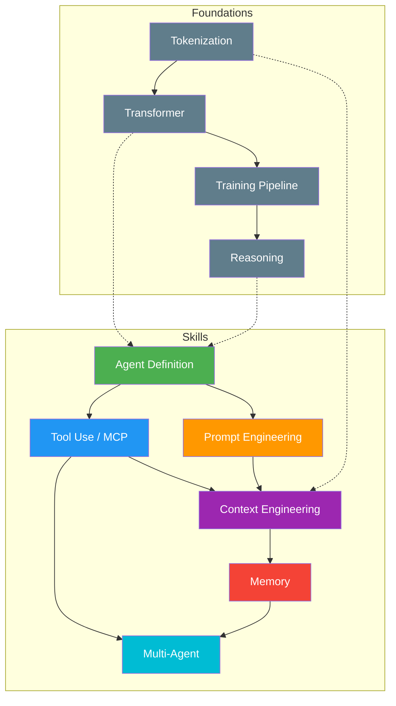

# AI Agent 知识 Wiki — 全局索引

> 用 Karpathy 的 LLM 知识库方法，将 13 个参考仓库编译为结构化知识文章。
> 所有内容由 LLM 生成和维护。原始数据在 `../repos/`。

## 阅读路径

```
入门路径 (从零开始):
agent-definition → tool-use-mcp → prompt-engineering
    → context-engineering → memory → multi-agent

基座路径 (理解底层):
tokenization → transformer → training-pipeline → reasoning

深度路径 (按需查阅):
任一文章 → 底部"概念间关系" → 跳转到相关文章
```

---

## Phase 2: Agent 技能 (skills/) — ✅ 第一批已完成

| # | 文章 | 核心问题 | 状态 |
|---|------|---------|------|
| 1 | [Agent 核心定义](skills/agent-definition.md) | 什么是 Agent？最简实现是什么？ | ✅ |
| 2 | [Tool Use 与 MCP](skills/tool-use-mcp.md) | Agent 如何扩展能力？工具如何注册？ | ✅ |
| 3 | [Prompt Engineering](skills/prompt-engineering.md) | 如何设计有效指令？Skill 如何按需加载？ | ✅ |
| 4 | [Multi-Agent 编排](skills/multi-agent.md) | 多 Agent 如何协作？有哪些模式？ | ✅ |
| 5 | [Context Engineering](skills/context-engineering.md) | 如何管理有限的上下文窗口？ | ✅ |
| 6 | [Memory 架构](skills/memory.md) | Agent 如何拥有长期记忆？ | ✅ |

## Phase 1: 基座理论 (foundations/) — ✅ 第二批已完成

| # | 文章 | 核心问题 | 状态 |
|---|------|---------|------|
| 7 | [Transformer 架构](foundations/transformer.md) | 自注意力如何工作？GPT 完整实现 | ✅ |
| 8 | [BPE Tokenization](foundations/tokenization.md) | 文本如何变成 token？BPE 算法详解 | ✅ |
| 9 | [训练管线](foundations/training-pipeline.md) | 预训练→SFT→RLHF/GRPO 全流程 | ✅ |
| 10 | [Reasoning 机制](foundations/reasoning.md) | CoT/ReAct/GRPO 推理能力从哪来？ | ✅ |

## Phase 3: 生产级 (production/) — 📋 第三批待编译

| # | 文章 | 核心问题 | 状态 |
|---|------|---------|------|
| 12 | 架构对比 | OpenCode/ZeroClaw/OpenClaw 比较 | 📋 |
| 13 | 可观测性 | 如何监控 Agent 行为？ | 📋 |
| 14 | 多通道 | Telegram/Web/CLI 如何统一？ | 📋 |
| 15 | Identity | 如何设计 Agent 人格？ | 📋 |
| 16 | 失败恢复 | Agent 挂了怎么办？ | 📋 |

---

## 概念关系图



## 交叉引用速查

| 如果你想了解... | 看这篇 |
|---------------|--------|
| Agent 的最简实现 | [agent-definition](skills/agent-definition.md) |
| 如何安全地执行工具 | [tool-use-mcp](skills/tool-use-mcp.md) |
| System Prompt 怎么写 | [prompt-engineering](skills/prompt-engineering.md) |
| Handoff vs Team vs Protocol | [multi-agent](skills/multi-agent.md) |
| 上下文窗口快满了 | [context-engineering](skills/context-engineering.md) |
| Agent 如何记住用户 | [memory](skills/memory.md) |
| GPT 的内部结构 | [transformer](foundations/transformer.md) |
| 文本怎么变成 token | [tokenization](foundations/tokenization.md) |
| 模型怎么训练的 | [training-pipeline](foundations/training-pipeline.md) |
| 模型怎么学会推理 | [reasoning](foundations/reasoning.md) |

---

## 维护说明

- **编译频率**: 每次有新的原始材料加入 `../repos/` 时，重新编译相关文章
- **健康检查**: 定期检查交叉链接完整性、概念一致性
- **贡献方式**: 不要直接编辑 wiki 文章 — 修改原始材料后重新编译
