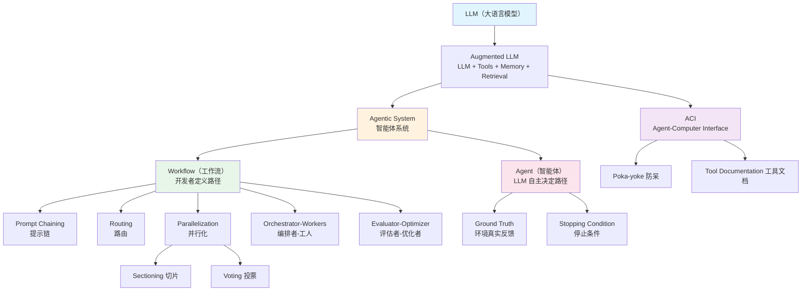

# Part 2: 面试准备 + 开源项目分析

> **关联：** [← Part 1 主笔记](./01a-study-anthropic-bea.md)  
> **Sprint 1 · Day 1 · Anthropic《Building Effective Agents》**

---

## 一、🔍 开源项目实战映射

> 每个 Anthropic 模式 → 哪些项目用了 → 核心代码/流程 → 效果分析

---

### 1.1 Augmented LLM → 几乎所有项目

**标准实现模式（伪代码）：**

```javascript
// 每个 Agent 框架的核心都是构造 Augmented LLM
const agent = {
  llm: "claude-sonnet-4-20250514",       // 基础模型
  tools: [searchTool, fileTool],   // 工具注册
  retrieval: vectorStore,          // 知识检索
  memory: conversationHistory,     // 对话记忆
  systemPrompt: "You are..."      // 身份指令
};
```

| 项目 | 怎么实现 Augmented LLM | 特点 |
|------|----------------------|------|
| **OpenCode** | Session + Provider + Tool Registry | 插件系统最灵活，Provider 可热切换 |
| **Claude Code** | 内置 Augmented LLM，工具通过 MCP 扩展 | 官方最佳实践，ACI 设计最精细 |
| **Codex CLI** | OpenAI Assistants API 封装 | Thread-based，服务端管理上下文 |
| **Muse** | OpenCode 底座 + MCP Tools + familyConfig | 多 member 各自独立的 Augmented LLM |

---

### 1.2 Prompt Chaining → CrewAI 的 Sequential Process

**CrewAI** 是 Prompt Chaining 的典型实现：

```python
# CrewAI 的 Sequential Process — 一个 Agent 做完交给下一个
crew = Crew(
    agents=[researcher, writer, editor],
    tasks=[research_task, writing_task, editing_task],
    process=Process.sequential  # ← 关键：固定顺序
)
result = crew.kickoff()
# researcher → writer → editor，每步输出是下一步输入
```

**为什么效果好：** 每个 Agent 只需要专注一件事，prompt 可以高度特化。  
**缺点：** 顺序固定 — 如果 editor 发现 researcher 的数据有问题，没有回退机制。

**Muse 启发 💡：** muse-harness 如果 planner 的步骤是固定的（arch → coder → reviewer），本质上就是 CrewAI Sequential。这不一定是坏事——但要意识到这个选择的代价。

---

### 1.3 Routing → OpenCode 的模型路由

**OpenCode** 的多 Provider 配置天然就是 Routing：

```json
// OpenCode 的 oh-my-opencode.json 配置
{
  "models": {
    "large": { "provider": "anthropic", "model": "claude-sonnet-4-20250514" },
    "small": { "provider": "anthropic", "model": "claude-haiku-4" }
  }
}
// 简单问题 → small，复杂问题 → large
```

**Anthropic 的理论在这里：** 简单请求走便宜模型（Routing），复杂请求走强模型。

**更高级的 Routing — Clowder AI 的 @mention 路由：**

```
用户: @opus 帮我分析这个架构
→ Router 识别 @opus → 路由到 Claude Opus 实例

用户: @codex 帮我 review 这段代码
→ Router 识别 @codex → 路由到 Codex CLI 实例
```

Clowder 的 **A2A Router** 不只做模型路由，而是做 **Agent 路由** — 每个 Agent CLI 是独立进程，Router 根据 @mention 分发消息。

**Muse 启发 💡：** Muse 的 Telegram 消息分发已经是 Agent Routing。但可以考虑加入**智能路由**（不需要用户 @mention，planner 自己判断谁最合适）。

---

### 1.4 ⭐ Orchestrator-Workers → Swarm & muse-harness

**OpenAI Swarm** 的核心循环：

```python
# Swarm 的 run() 简化版 — 来源: openai/swarm/core.py
def run(agent, messages):
    while True:
        # 1. 调用 LLM
        response = client.chat.completions.create(
            model=agent.model,
            messages=[{"role": "system", "content": agent.instructions}] + messages,
            tools=agent.functions,        # 注册的工具
        )
        message = response.choices[0].message
        
        # 2. 如果没有工具调用，结束
        if not message.tool_calls:
            break
        
        # 3. 执行工具调用
        for tool_call in message.tool_calls:
            result = execute_tool(tool_call)
            
            # 4. 如果工具返回了一个 Agent → Handoff！
            if isinstance(result, Agent):
                agent = result  # 切换到新 Agent
                
        messages.append(message)
    return response
```

🔑 **Swarm 的精妙之处：** Handoff（交接）不是特殊 API，而是**工具返回一个 Agent 对象**。当 Agent A 的工具返回 Agent B 时，循环自动切换到 B。极度简洁。

**和 Anthropic Orchestrator-Workers 的关系：**
- Swarm 的 Orchestrator 是**隐式的** — 每个 Agent 通过 Handoff 工具动态选择下一个 worker
- Anthropic 描述的是**显式的** — 一个中央 Orchestrator 统一拆解分派

**Muse 启发 💡：** Muse planner 更接近 Anthropic 的显式 Orchestrator。但 Swarm 的 Handoff 模式也值得考虑——如果 coder 在执行中发现需要 arch 介入，是否可以**工具级 Handoff** 而不是回到 planner？

---

### 1.5 Evaluator-Optimizer → SWE-bench & Code Review 流程

**Claude Code / Cursor 的 Apply-then-Test 循环：**

```
开发者给出需求
    ↓
Claude 写代码（Generator）
    ↓
运行测试（Evaluator = 自动化测试）
    ↓
测试失败？ → 反馈错误信息给 Claude → 修改代码 → 再测试
    ↓ 测试通过
结束
```

这就是 Evaluator-Optimizer 的**最简实现**：Evaluator 不是 LLM，而是测试框架。

**Anthropic 原文印证：**
> *"Code solutions are verifiable through automated tests; Agents can iterate on solutions using test results as feedback."*

**更高级的版本 — LLM 作为 Evaluator：**

```python
# 伪代码: Evaluator-Optimizer with LLM Evaluator
for i in range(max_iterations):
    code = generator_llm.generate(task, feedback)
    evaluation = evaluator_llm.evaluate(code, criteria=[
        "correctness", "readability", "performance"
    ])
    if evaluation.passed:
        break
    feedback = evaluation.suggestions  # 反馈给 generator
```

**Muse 启发 💡：** S2 的 reviewer 就是 Evaluator。当前是"一次 review"，可以升级为"迭代 review"——coder 修改 → reviewer 再看 → 直到通过或达到上限。

---

### 1.6 ACI 实战 → Claude Code 的工具设计

**Claude Code 的文件编辑工具设计（体现 ACI 原则）：**

| ACI 原则 | Claude Code 怎么做 | 为什么好 |
|---------|-------------------|---------|
| 给足思考空间 | 先让 LLM 描述要改什么，再生成具体 diff | 不是一步到位 |
| 贴近自然格式 | 用搜索+替换而非行号 diff | LLM 更擅长文本匹配 |
| 避免格式开销 | 不要求严格 JSON 包裹代码 | 减少转义错误 |
| 防呆 (Poka-yoke) | 强制绝对路径 | 消除路径歧义 |

**对比 Codex CLI：**

```
# Codex 的做法：sandbox 执行
Codex 在隔离容器中运行，Agent 的工具调用直接在 sandbox 里执行。
即使 Agent 犯错，也不会影响宿主系统。
→ 这是另一种 Poka-yoke：不是防止错误，而是隔离错误影响。
```

---

### 1.7 Multi-Agent 团队 → Clowder AI 的架构

**Clowder AI** 的核心理念是 **"Build AI teams, not just agents"**：

```
┌──────────────────────────────────────────┐
│               Clowder Platform           │
│                                          │
│  Identity     A2A Router    Skills       │
│  Manager      & Threads     Framework    │
│                                          │
│  Memory &     SOP MCP       Callback     │
│  Evidence     Guardian      Bridge       │
└───┬──────────┬──────────┬────────┬───────┘
    │          │          │        │
 Claude     GPT/Codex   Gemini   opencode
```

**VS Muse 的架构：**

| 维度 | Clowder | Muse | 差异分析 |
|------|---------|------|---------|
| 多模型支持 | ✅ Claude+GPT+Gemini+opencode | ⚠️ 通过 OpenCode Provider 切换 | Clowder 更原生 |
| 身份持久化 | ✅ Identity Manager | ✅ familyConfig + persona | 类似 |
| 通信方式 | A2A Router (基于 Thread) | MCP 工具调用 | Muse 更松耦合 |
| 安全机制 | Iron Laws（硬性规则） | Governance/Guardian | 理念类似 |
| 交互入口 | Web UI + 飞书 + GitHub PR | Telegram | Clowder 更丰富 |
| 核心卖点 | AI 团队文化（Soft Power） | AI 生命体（人格+记忆） | **理念方向不同** |

**关键差异 🔑：** Clowder 强调 "团队协作文化"，Muse 强调 "AI 生命体"。  
Clowder 的技术选型（Thread-based routing, Multi-CLI integration）对 Muse 有借鉴，但核心理念不同。

---

## 二、💼 面试准备

### 2.1 基础概念题

**Q: 什么是 Agentic System？和普通 LLM 应用有什么区别？**

> **A:** Agentic System 是使用 LLM 做决策的系统，包含 Workflow 和 Agent 两种形态。和普通 LLM 应用（单次调用）的区别是：Agentic System 涉及**多步决策**，LLM 在循环中参与流程控制，而不只是一问一答。Anthropic 在 2024 年 12 月发表的《Building Effective Agents》中首次系统化了这个分类。

**Q: 什么是 ACI？为什么它很重要？**

> **A:** ACI 是 Agent-Computer Interface — 工具给 Agent 的接口设计。HCI 关注人如何使用界面，ACI 关注 LLM 如何使用工具。Anthropic 的 SWE-bench 团队花在工具优化上的时间比 prompt 优化还多。工具的参数命名、文档、格式设计直接影响 Agent 的任务完成率。

**Q: 什么是 Poka-yoke？在 Agent 开发中怎么应用？**

> **A:** Poka-yoke 是日本丰田生产系统中的"防呆设计"概念。在 Agent 开发中，意味着从工具接口层面让错误变得不可能。比如 Anthropic 把文件操作工具改成只接受绝对路径，而不是靠 prompt 告诉 Agent "请用绝对路径"。**不是靠教育，而是靠设计消除错误。**

### 2.2 对比题

**Q: Workflow 和 Agent 有什么区别？各自适合什么场景？**

> **A:** 
> - Workflow：开发者预定义执行路径，LLM 按路走。适合任务明确、步骤固定的场景（如文档生成流水线）。优点是可预测、成本低。
> - Agent：LLM 自主决定路径。适合开放式问题、步骤数不可预测的场景（如自动修 bug）。代价是更高成本和错误累积风险。
> - Anthropic 建议：**先 Workflow，不够再升 Agent。**

**Q: Orchestrator-Workers 和 Parallelization 有什么区别？**

> **A:** 关键区别是子任务**是否预定义**。Parallelization 的子任务在代码里写死（比如"同时做安全检查和内容生成"），Orchestrator-Workers 的子任务由中央 LLM **动态决定**（比如分析一个 coding task 后决定要改哪几个文件）。

**Q: Swarm 的 Handoff 和 CrewAI 的 Sequential Process 有什么设计差异？**

> **A:** Swarm 用"工具返回 Agent 对象"实现隐式 Handoff，控制权动态转移，更灵活但不可预测。CrewAI 用显式的 Sequential/Hierarchical Process，流程固定但可控。前者适合需要动态路由的场景（如客服分诊），后者适合步骤确定的场景（如内容生产流水线）。

### 2.3 设计题

**Q: 如果让你设计一个 multi-agent 编码系统，你会怎么设计？**

> **A（STAR 格式）：**
> 
> **Situation:** 需要设计一个自动完成 GitHub Issue 的多 Agent 系统。
> 
> **Task:** 从 Issue 描述到 PR 提交的全自动化。
> 
> **Action:** 
> 1. 采用 **Orchestrator-Workers** 模式（Anthropic 推荐的编码场景模式）
> 2. Orchestrator 分析 Issue → 确定要改哪些文件 → 分派 Worker
> 3. 每个 Worker 是 Augmented LLM（有代码搜索、文件编辑、测试运行工具）
> 4. 用 **Evaluator-Optimizer** 循环：Worker 写完 → 跑测试 → 失败则反馈修改
> 5. ACI 设计遵循 Poka-yoke：工具只接受绝对路径、强制 lint 格式化
> 6. Guardrails 分离：一个 LLM 写代码，另一个并行做安全审计
> 
> **Result:** 类似 Anthropic SWE-bench 的架构——他们用这个方法在 SWE-bench Verified 上取得了领先成绩。

### 2.4 故事题（基于 Muse）

**故事 1：「为什么 Muse 选择 Workflow 而非纯 Agent」**

> 我在做 Muse 时读了 Anthropic 的《Building Effective Agents》，里面强调 "start with the simplest solution" 和 "only increase complexity when needed"。我们的 muse-harness（多 Agent 协作场景）最初考虑过纯 Agent 架构——让 planner 完全自主决策。但分析发现我们的核心工作流（拆解→编码→审查）其实步骤比较固定，更适合 Orchestrator-Workers Workflow。这么做的好处是可预测性更好、调试更容易、成本更低。只在 planner 需要动态决定"改哪些文件"时才引入动态拆解。

**故事 2：「ACI 思维如何改变了工具设计」**

> 读到 Anthropic 的 ACI 章节时，有一个洞察让我印象深刻：他们的 SWE-bench 团队把工具设计的相对路径改成绝对路径后，错误直接消失。这是典型的 Poka-yoke 思维——不是靠 prompt 教育模型，而是从接口设计上杜绝错误。我在 Muse 的 MCP 工具设计中应用了同样的理念：比如 member_id 使用确定性 ID 而非模糊的角色名称，工具返回值做精简避免信息过载。

**故事 3：「渐进式复杂度的实践」**

> Anthropic 文章最重要的一条原则是"渐进式复杂度"——先试最简方案，有证据证明不够才升级。我在 Muse 中实践这个原则：S1（日常对话）就是最简的单 Augmented LLM，不需要多 Agent；S2（muse-harness）升级到 Orchestrator-Workers；S3（审批）再叠加 Evaluator-Optimizer 和 HITL。每一层复杂度都有明确的理由。

---

## 三、📊 行业全景：Agent 框架对比

| 框架 | 厂商 | 核心编排模式 | 语言 | 亮点 | 局限 |
|------|------|------------|------|------|------|
| **Swarm** | OpenAI | Handoff (隐式 Orchestrator) | Python | 极简、Handoff 机制精妙 | 实验性项目，无生产支持 |
| **Agents SDK** | OpenAI | Workflow + Guardrails | Python | 内置 tracing、provider-agnostic | 新框架，生态未成熟 |
| **LangGraph** | LangChain | Graph 状态机 | Python | 最灵活的状态管理、Checkpointer | 学习曲线陡、调试复杂 |
| **CrewAI** | 独立 | Sequential/Hierarchical | Python | 角色定义直观、上手快 | 对动态任务支持有限 |
| **AutoGen** | Microsoft | Multi-turn 对话 | Python | 事件驱动、异步通信 | 架构较重 |
| **Claude Code** | Anthropic | Agent Loop | TypeScript | ACI 设计最佳实践 | 闭源 |
| **Codex CLI** | OpenAI | Agent Loop + Sandbox | TypeScript | 沙盒隔离安全 | 依赖 OpenAI 模型 |
| **OpenCode** | SST | Plugin + Hook | Go | 插件系统最灵活 | 文档不完善 |
| **Clowder AI** | 独立 | A2A Router + Thread | TypeScript | 多模型团队文化、Identity 持久化 | 刚开源、社区初期 |
| **Dify** | 独立 | Low-code Visual | Python | 可视化搭建、门槛低 | 灵活性有限 |
| **Google ADK** | Google | Hierarchical | Python | 深度集成 GCP | 绑定 Google 生态 |
| **Agno** | 独立 | Multi-modal Agent | Python | 多模态、模型无关 | 较新 |

---

## 四、🔗 概念关系图



---

*Sprint 1 Day 1 · Part 2 完成 · 2026-03-27*
