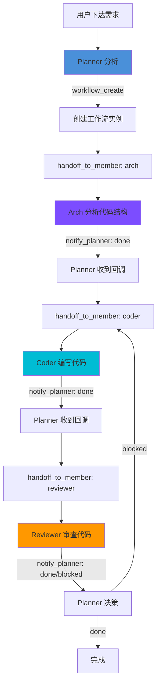

# Day 02：Anthropic 多 Agent 系统 + Orchestrator-Worker 模式

> **Sprint 1 · Day 2 · 类型：精读 + Muse 审查 + OpenCode 机制**  
> **学习目标：**  
> ① 掌握 Orchestrator-Worker 和 Evaluator-Optimizer 两种高级模式  
> ② 审查 Muse harness 代码，给出具体的改进建议  
> ③ 理解 OpenCode 的 Agent 系统 —  Session 隔离是怎么实现的

---

## 📖 Step 1: Orchestrator-Worker 模式详解

### 什么是 Orchestrator-Worker？

Day 1 学了 Chain / Parallel / Route 三种基础模式。今天进入高级模式。

**Orchestrator-Worker = 一个"大脑" + 多个"工人"**

```
用户需求 → [Orchestrator] → 分析需求 → 决定需要哪些子任务
                ↓
         ┌──────┼───────┐
         ↓      ↓       ↓
      [Worker1] [Worker2] [Worker3]    ← 各自独立执行
         ↓      ↓       ↓
         └──────┼───────┘
                ↓
         [Orchestrator] → 汇总结果 → 输出

```

### 和 Chain/Parallel 的区别

| 维度 | Chain | Parallel | Orchestrator-Worker |
|------|-------|----------|-------------------|
| **谁决定子任务？** | 代码预定义 | 代码预定义 | **LLM 动态决定** |
| **子任务数量** | 固定 | 固定 | **不固定，LLM 判断** |
| **适用场景** | 步骤明确 | 子任务已知 | **需求模糊，需要分析** |

**关键区别：** Chain/Parallel 的步骤是你写在代码里的。Orchestrator-Worker 的步骤是 LLM 自己决定的。

### Cookbook 代码剖析

> **文件：** `make-muse/reference/anthropic-cookbook/patterns/agents/orchestrator_workers.ipynb`

```python
def orchestrator(task: str, 
                 available_workers: dict[str, str],
                 context: str = "") -> str:
    """
    Orchestrator: 分析任务 → 分配给 workers → 汇总结果
    
    核心流程：
    1. 告诉 LLM 有哪些 Worker 可用
    2. LLM 分析任务，输出 <workers> XML → 列出需要哪些 worker 及各自的子任务
    3. 并行调用所有被选中的 worker
    4. LLM 汇总所有 worker 的结果
    """
    
    # Step 1: Orchestrator 分析任务，决定分配
    planning_prompt = f"""
    你是一个任务编排器。分析以下任务，决定需要哪些 worker：
    
    可用 workers: {list(available_workers.keys())}
    
    用 XML 格式输出你的分配方案：
    <workers>
      <worker>
        <name>worker名字</name>
        <task>分配给这个worker的具体子任务</task>
      </worker>
      ...
    </workers>
    
    Task: {task}
    Context: {context}
    """
    
    plan = llm_call(planning_prompt)
    # 解析 XML，提取每个 worker 的分配
    worker_assignments = parse_workers_xml(plan)
    
    # Step 2: 并行执行所有 worker
    results = {}
    with ThreadPoolExecutor() as pool:
        futures = {
            name: pool.submit(
                llm_call, 
                f"{available_workers[name]}\nTask: {subtask}"
            )
            for name, subtask in worker_assignments
        }
        results = {name: f.result() for name, f in futures.items()}
    
    # Step 3: 汇总
    synthesis_prompt = f"""
    原始任务: {task}
    
    各 Worker 的输出:
    {format_results(results)}
    
    请综合所有 Worker 的输出，给出最终答案。
    """
    return llm_call(synthesis_prompt)
```

### Evaluator-Optimizer 模式

**另一个高级模式：让两个 LLM 互相对抗**

```
[Generator] → 生成初稿 → [Evaluator] → 评分 + 反馈
     ↑                                      ↓
     └──── 根据反馈改进 ←────────────────────┘
     
     循环直到 Evaluator 说 "通过" 或达到最大轮次
```

```python
def evaluator_optimizer(task: str, max_rounds: int = 3) -> str:
    """
    两个 LLM 互相对抗，直到产出质量达标
    """
    result = llm_call(f"完成以下任务:\n{task}")  # Generator 初稿
    
    for round in range(max_rounds):
        # Evaluator 评分
        eval_prompt = f"""
        任务要求: {task}
        当前方案: {result}
        
        评估这个方案的质量 (PASS/NEEDS_IMPROVEMENT)。
        如果需要改进，给出具体建议。
        
        <verdict>PASS 或 NEEDS_IMPROVEMENT</verdict>
        <feedback>具体反馈</feedback>
        """
        evaluation = llm_call(eval_prompt)
        
        if extract_xml(evaluation, "verdict") == "PASS":
            return result  # 够好了，结束
        
        # Generator 根据反馈改进
        feedback = extract_xml(evaluation, "feedback")
        result = llm_call(f"根据反馈改进:\n反馈: {feedback}\n原方案: {result}")
    
    return result  # 达到最大轮次，返回最后版本
```

### 🎯 Muse 的映射

**Muse Harness 就是 Orchestrator-Worker 模式的实例：**

| 角色 | Orchestrator-Worker 对应 |
|------|------------------------|
| Planner | **Orchestrator** — 分析用户需求，决定分配 |
| Arch / Coder / Reviewer | **Workers** — 各自执行子任务 |
| `workflow_create` | Orchestrator 的 planning 步骤 |
| `handoff_to_member` | 分配 worker 的动作 |
| `notify_planner` | Worker 完成后的回调 |

**但 Muse 和纯 Orchestrator-Worker 的差异：**
- Muse 的 Worker 流程是**预定义的**（arch → coder → reviewer），不是 LLM 动态决定
- 这意味着 Muse 目前更像 **Chain + Orchestrator-Worker 的混合体**
- 未来可以让 Planner 自己决定需要几个 Worker、什么顺序

---

## 🎯 Step 2: Muse Harness 代码审查

### 你要审查的两个核心文件

#### 文件 1: `src/mcp/planner-tools.mjs` — Planner 的工具集

**当前设计：** Planner 有 8 个工具

| 工具 | 功能 | 对应 Orchestrator-Worker 哪个步骤 |
|------|------|-------------------------------|
| `workflow_create` | 创建工作流 | Orchestrator 的 planning |
| `workflow_status` | 查看状态 | Orchestrator 的监控 |
| `workflow_admin_transition` | 强制状态转换 | Orchestrator 的干预 |
| `workflow_inspect` | 检查详情 | Orchestrator 的监控 |
| `workflow_rollback` | 回滚 | Orchestrator 的纠错 |
| `workflow_update` | 更新工作流 | Orchestrator 的调整 |
| `handoff_to_member` | 分派任务 | **分配 Worker** |
| `read_artifact` | 读产出物 | Orchestrator 读 Worker 结果 |

**🔴 审查发现（AI 已帮你读完代码）：**

1. **`role` 参数没有 enum** — `handoff_to_member` 的 `role` 参数是自由文本。LLM 可能传 `"Coder"` 而不是 `"coder"`，大小写不一致会导致找不到成员。
   - **改进：** 加 `enum: ['pua', 'arch', 'coder', 'reviewer']`

2. **`instructions` 字段说"不生效"** — `handoff_to_member` 的 instructions 描述写 "本期保留字段但不生效"。这会让 LLM 困惑。
   - **改进：** 要么删掉、要么改描述为 "对 worker 的额外指令（将追加到 system prompt）"

3. **工具太多** — Planner 有 8 个工具，但日常使用只需要 3-4 个。工具越多 LLM 越容易调错。
   - **改进：** 考虑分层 — 日常3个(create/handoff/status) + 管理5个(admin/inspect/rollback/update/read)

#### 文件 2: `src/family/handoff.mjs` — 实际执行 Handoff 的代码

**这是 Planner 调用 `handoff_to_member` 后，真正发生的事：**

```
Planner 调 handoff_to_member(role='coder')
    → handoff.mjs 找到 coder 成员的 OpenCode 实例
    → 向 coder 的 /message 端点 POST 任务 prompt
    → coder 开始工作（独立 session）
    → coder 完成后调 notify_planner
    → Planner 收到通知，继续下一步
```

**🔴 审查发现：**

1. **Handoff 是单向的** — Planner 发任务后只能等 `notify_planner` 回调。如果 Worker 挂了、超时了，没有自动检测机制。
   - **改进：** 加健康检查轮询 或 超时机制 (Anthropic 建议的 "Gate" 检查)

2. **没有 Worker 选择逻辑** — `role` 直接映射到固定成员。不支持同一角色有多个实例（负载均衡）。
   - **这在 Sprint 1 不需要改，但 Sprint 6 要考虑**

### Harness 流程图（你的产出）



**标注：**
- 这是一个 **Chain 模式**（顺序：arch → coder → reviewer）
- Planner 充当 **Orchestrator**，但节点顺序是预定义的
- reviewer blocked 时可回溯 → 这是 **Evaluator-Optimizer** 的雏形

---

## 🔧 OpenCode 机制：Agent 系统解读

> **参考：** `make-muse/reference/learn-opencode/docs/5-advanced/02a-agent-quickstart.md`

### OpenCode Agent 的本质

引用 learn-opencode 原文：

> "OpenCode 的 Agent 是**可配置的 AI 人格** — 你可以定义它的身份、能力和行为。"

### 🔑 关键机制：Session 隔离

**这是 OpenCode 最重要的设计决策之一：**

```
主 Agent (build)
├── Session: 有完整对话历史
├── 用户说: "帮我写一个 API"
├── 用户说: "加个鉴权"    ← 这些上下文主 Agent 都有
└── Task → 创建 Subagent Session
         └── Subagent (explore)
             ├── Session: 全新的、空的！
             ├── 只有被分配的 task prompt
             └── 看不到主 Agent 的对话历史 ← 关键！
```

**为什么要隔离？**

| 不隔离的问题 | 隔离后的好处 |
|------------|-----------|
| Subagent 被主 Agent 的上下文干扰 | 专注于自己的任务 |
| 上下文窗口爆满 | 每个 Worker 都是干净的 |
| Subagent 可能误用主 Agent 的指令 | 行为可预测 |

### OpenCode 内置 Agent 对照

| OpenCode Agent | 类型 | Muse 对应 |
|---------------|------|----------|
| `build` | Primary | Muse 的 pua（日常对话） |
| `plan` | Primary | Muse 的 Planner |
| `explore` | Subagent | Muse 的 Arch |
| `general` | Subagent | Muse 的 Coder |
| `title` | 隐藏 | Muse 没有 |
| `compaction` | 隐藏 | Muse 没有（但需要！） |

### 🎯 对 Muse 的 3 个关键启发

**启发 1：Session 隔离 — Muse 已经在做了。** Muse 的每个 member (pua/arch/coder) 都是独立的 OpenCode 实例，天然隔离。✅

**启发 2：Agent 定义方式 — Muse 可以借鉴。** OpenCode 用 `.md` 文件定义 Agent prompt，简洁高效。Muse 目前的 identity 注入是通过 `AGENTS.md`，但可以参考 OpenCode 的 frontmatter 结构（description / mode / permission）让定义更标准化。

**启发 3：Permission 权限控制 — Muse 缺少这个。** OpenCode 的 Agent 可以精确控制工具权限：
```yaml
# OpenCode 的做法
permission:
  edit: deny          # 禁止编辑
  bash:
    "*": deny         # 禁止所有命令
    "git log*": allow # 只允许查日志
```

Muse 的 reviewer 应该是只读的（不能改代码），但目前没有权限控制。这是 Sprint 6 的输入。

---

## 📚 c 课程：Cookbook Orchestrator-Workers 代码详解

> **文件位置：** `make-muse/reference/anthropic-cookbook/patterns/agents/orchestrator_workers.ipynb`

这个 notebook 演示了一个真实场景：

**用例：根据"可持续运营的中等企业"需求，同时派出多个 Worker 写不同章节的商业计划**

```python
available_workers = {
    "market_analyst": "你是市场分析师...",
    "financial_planner": "你是财务规划师...",
    "operations_designer": "你是运营设计师...",
    "marketing_strategist": "你是营销策略师...",
}

# Orchestrator 不是人工指定 Worker，而是让 LLM 自己决定
result = orchestrator(
    "为一家中等规模的可持续服装企业制定详细的商业计划",
    available_workers
)
```

**执行过程：**
1. Orchestrator LLM 分析任务 → 决定需要 4 个 Worker 全部上阵
2. 给每个 Worker 分配具体子任务（不是泛泛的"做你的事"，而是具体的分析点）
3. 4 个 Worker 并行执行
4. Orchestrator 汇总 4 份报告

### 和 Day 1 Parallel 的区别

```
Day 1 Parallel:
prompt = "分析影响"  ← 固定 prompt
inputs = [客户, 员工, 股东]  ← 固定输入

Day 2 Orchestrator:
prompt = 由 LLM 根据任务自动生成!  ← 动态
workers = 由 LLM 从可用列表中选择!  ← 动态
```

---

## 📰 e 大佬：Andrew Ng 的 4 Agentic Patterns

> **身份：** DeepLearning.AI 创始人 / Stanford 教授  
> **来源：** 2024 年演讲 + 系列博文

### 四种 Agent 模式

Andrew Ng 总结了 4 种核心模式（和我们学的高度吻合）：

| # | 模式 | Ng 的解释 | 对应我们学的 |
|---|------|---------|------------|
| 1 | **Reflection** | Agent 审查自己的输出并改进 | Day 2: Evaluator-Optimizer |
| 2 | **Tool Use** | Agent 调用外部工具获取信息 | Day 1: 所有模式的基础 |
| 3 | **Planning** | Agent 把任务分解成子任务 | Day 2: Orchestrator-Worker |
| 4 | **Multi-Agent** | 多个 Agent 协作完成任务 | Day 2: 整个 harness |

### Ng 的关键观点

> "在 GPT-3.5 + Agentic Workflow 的表现优于 GPT-4 的零样本推理。"

**翻译成大白话：** 给弱模型加上好的工作流，比强模型直接上更好。**这就是 Muse 存在的意义** — 不是依赖最强的模型，而是用好的编排让中等模型发挥超常水平。

---

## ✏️ Step 3: 沉淀

### 吸收检验（心里想清楚即可）

1. **面试题：** Orchestrator-Worker 和 Parallel 的核心区别是什么？
   - 答案关键词：子任务是「代码预定义」还是「LLM 动态决定」

2. **面试题：** Andrew Ng 的 4 Agentic Patterns 是什么？
   - Reflection, Tool Use, Planning, Multi-Agent

3. **设计题：** Muse 的 harness 目前是 Chain 还是 Orchestrator-Worker？为什么？
   - 混合体 — 节点顺序是 Chain（预定义），但 Planner 负责决策是 Orchestrator

4. **代码审查的3个最紧急改进：**
   - `handoff_to_member.role` 加 enum
   - `instructions` 描述去掉"不生效"
   - 加 Worker 超时检测

---

*Day 02 完成于 Sprint 1 · 2026-03-28*
