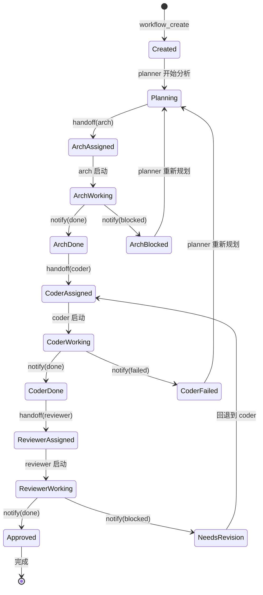

# Day 05：LangGraph 概念 + 工作流状态图 + OpenCode Compaction

> **Sprint 1 · Day 5 · 类型：学习 + Muse 设计 + OpenCode 机制**  
> **学习目标：**  
> ① 掌握 LangGraph 的 Graph 状态机概念  
> ② 为 Muse harness 画状态机图  
> ③ 理解 OpenCode 的上下文压缩机制

---

## 📖 Step 1: LangGraph 核心概念

### LangGraph vs 其他框架的定位

| 框架 | 核心抽象 | 适用场景 | 复杂度 |
|------|---------|---------|-------|
| **Swarm** | Agent + Handoff | 简单多 Agent | ⭐ |
| **CrewAI** | Role + Task | 角色扮演式协作 | ⭐⭐ |
| **LangGraph** | Graph + State + Checkpoint | **需要持久化、回放、人类干预的复杂工作流** | ⭐⭐⭐ |

### LangGraph 三个核心概念

#### 1. State（状态）

```python
from typing import TypedDict, Annotated
from langgraph.graph import add_messages

class AgentState(TypedDict):
    messages: Annotated[list, add_messages]  # 对话历史（自动追加）
    current_step: str                         # 当前步骤
    artifacts: dict                           # 产出物
    approval_status: str | None               # 审批状态
```

**状态就是整个工作流的"记忆"。** 每个节点执行后更新状态，传给下一个节点。

#### 2. Graph（图）

```python
from langgraph.graph import StateGraph

# 定义节点
graph = StateGraph(AgentState)
graph.add_node("plan", plan_node)       # Planner 节点
graph.add_node("execute", exec_node)    # 执行节点
graph.add_node("review", review_node)   # 审查节点
graph.add_node("human", human_node)     # 人类审批节点

# 定义边（流转规则）
graph.add_edge("plan", "execute")
graph.add_conditional_edges(
    "execute",
    should_review,                       # 条件函数
    {"review": "review", "done": END}
)
graph.add_conditional_edges(
    "review",
    review_result,
    {"pass": END, "revise": "execute", "escalate": "human"}
)
```

#### 3. Checkpointer（检查点）

```python
from langgraph.checkpoint.sqlite import SqliteSaver

checkpointer = SqliteSaver.from_conn_string(":memory:")
app = graph.compile(checkpointer=checkpointer)

# 执行，每个节点自动保存状态
result = app.invoke(initial_state, config={"configurable": {"thread_id": "1"}})

# 下次可以从中间恢复！
result = app.invoke(None, config={"configurable": {"thread_id": "1"}})
```

**Checkpointer 的价值：** 工作流挂了可以重启、人类审批可以暂停恢复、可以回放调试。

### LangGraph vs Swarm 的关键差异

| 维度 | Swarm | LangGraph |
|------|-------|-----------|
| **状态** | 无（stateless） | 显式 State 类型 |
| **持久化** | 无 | Checkpointer |
| **恢复** | 不支持 | 从检查点恢复 |
| **人类参与** | 不支持 | interrupt_before / interrupt_after |
| **可视化** | 无 | Graph 可画图 |
| **复杂度** | 极低 | 中等 |

---

## 🎯 Step 2: Muse 工作流状态图

### Muse Harness 状态机



### Checkpointer 需要保存什么？

| 状态字段 | 类型 | 为什么要保存 |
|---------|------|-----------|
| `instance_id` | string | 唯一标识 |
| `current_node` | string | 执行到哪一步了 |
| `node_history` | array | 每个节点的输入/输出/时间 |
| `artifacts` | map | 各阶段产出物路径 |
| `error_count` | number | 重试了几次 |

**当前 Muse 的状态管理：** 用 `src/workflow/bridge.mjs` 的内存对象。没有持久化。  
**Sprint 3+ 改进：** 参考 LangGraph 加 SQLite Checkpointer。

---

## 🔧 OpenCode 机制：Compaction（上下文压缩）

> **参考：** `learn-opencode/docs/5-advanced/20-compaction.md` + OpenCode 源码分析

### 为什么需要压缩？

LLM 的上下文窗口是有限的（200k tokens）。长对话会撑满窗口。

```
对话开始: [系统 prompt] [用户消息1] ... 
    → 3000 tokens

20轮对话后: [系统 prompt] [20轮消息] [工具调用结果] ... 
    → 180000 tokens → 快满了！

压缩后: [系统 prompt] [压缩摘要] [最近5轮消息] 
    → 8000 tokens → 可以继续
```

### OpenCode 的压缩流程

```
检测上下文使用率 > 阈值
    → 触发 compaction agent（隐藏 Agent）
    → compaction agent 读取全部对话历史
    → 生成结构化摘要（保留关键信息）
    → 可选: 触发 session.compacting Hook → 注入额外上下文
    → 用摘要替换旧历史
    → 继续对话
```

### 🎯 Muse 的问题和改进

**当前问题：** Muse 的 pua 角色长期陪聊，上下文会撑满。但 Muse 没有自己的压缩策略。

**改进方向：**
1. **利用 OpenCode 内置 compaction** — 已有，但 Muse 没有定制化（比如压缩时保留 memory 里的用户偏好）
2. **compaction Hook 注入** — 压缩时注入 "Later 是谁 / 最近任务 / 重要记忆"
3. **Workflow 压缩** — Planner 的工作流执行过程也需要压缩，不然多轮 handoff 后上下文爆满

---

## 📚 c 课程：HF Agents Course Unit 2 — Tool Use

### 核心观点提取

HuggingFace 课程 Unit 2 重点讲工具使用。关键概念：

| 概念 | 解释 | Muse 对应 |
|------|------|----------|
| **Tool Schema** | JSON Schema 定义工具输入输出 | MCP inputSchema ✅ |
| **Tool Execution** | LLM 输出 → 解析 → 调用 → 返回 | OpenCode Tool Pipeline ✅ |
| **Error Handling** | 工具执行失败的处理 | Muse notify_planner(failed) ✅ |
| **Tool Selection** | LLM 从多工具中选择 | Muse MCP 注册所有工具 ✅ |

### 关键洞察

> "工具描述的质量直接决定 LLM 能否正确使用工具。一个好的描述值 100 行代码。"

这和 Day 1 的 ACI 原则完全一致。

---

## ✏️ Step 3: 沉淀

### 吸收检验

1. LangGraph 的核心三元素？(State + Graph + Checkpointer)
2. Checkpointer 解决什么问题？(持久化 + 恢复 + 回放)
3. OpenCode 压缩触发条件？(上下文使用率 > 阈值)
4. Muse 的 Harness 状态机有哪几个主要状态？(Created → Planning → Working → Done)

---

*Day 05 完成于 Sprint 1 · 2026-03-28*
