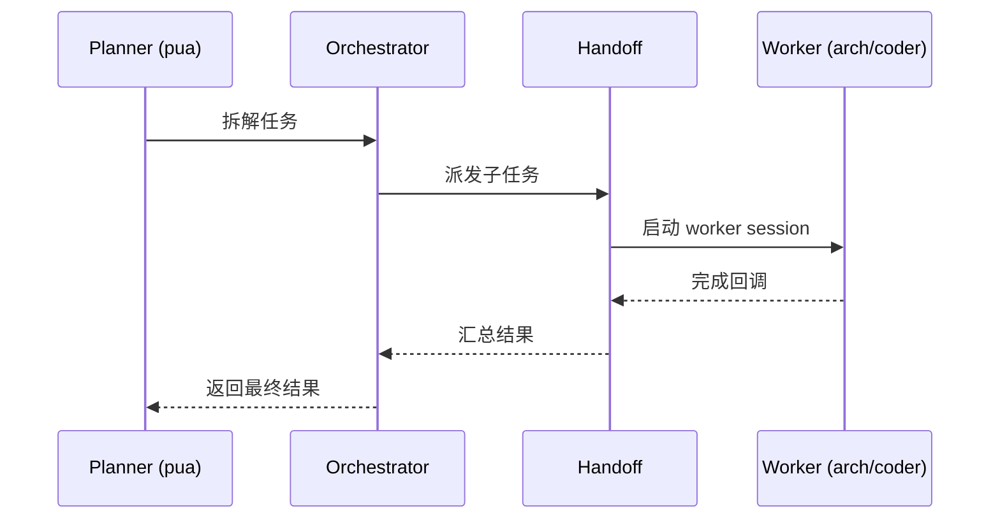

# oc32: 走读 Muse Harness 三件套源码

> **USOLB:** `[S]`源码
> **Bloom Level:** 2 — 理解
> **对应理论:** 02a + 01a §2.4 Orchestrator-Workers
> **目标:** 读 orchestrator + handoff + planner-tools 三件套，画出完整调用链

---

## 三件套关系

```
planner-tools.mjs (工具定义) → orchestrator.mjs (编排逻辑) → handoff.mjs (成员切换)
```

### 1. `src/mcp/planner-tools.mjs`

| 函数/工具 | 做了什么 | 行号 |
|----------|---------|------|
| （填写） | （填写） | L? |

### 2. `src/core/orchestrator.mjs`

| 函数 | 做了什么 | 行号 |
|------|---------|------|
| （填写） | （填写） | L? |

### 3. `src/family/handoff.mjs`

| 函数 | 做了什么 | 行号 |
|------|---------|------|
| （填写） | （填写） | L? |

---

## 调用链时序图

（走读完填写 Mermaid 图）



---

## 关键发现

| 问题 | 答案 |
|------|------|
| 编排是同步还是异步？ | （填写） |
| Worker 失败怎么处理？ | （填写） |
| 和 BEA Orchestrator-Workers 模式的差异？ | （填写） |
