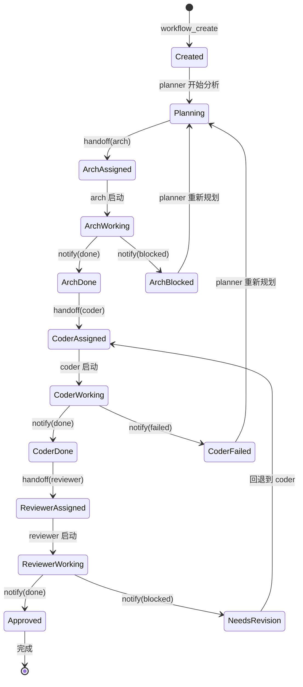

# 状态机 + LangGraph + OpenCode Compaction

> **来源：** [D3] LangGraph 短课 + `repos/ai-agents-for-beginners/07-planning-design/` [C8]
> **补充：** OpenCode 上下文压缩机制 + CrewAI 设计对比 + Karpathy LLM OS
> **上游：** 03a Memory + 向量嵌入
> **下游：** unit04 Prompt Eng → Week 4 面试
> **OC 关联：** oc20 (OpenCode Compaction 走读) / oc21 (Muse memory 审计)

---

## ⚡ 3 分钟速读版

```
一句话: Agent 需要状态机来管理复杂工作流（暂停/恢复/回滚/人类干预）
LangGraph 三元素: State(记忆) + Graph(流程图) + Checkpointer(持久化)
vs Swarm: Swarm无状态 LangGraph有状态+持久化+恢复
Compaction: 上下文快满时 → 压缩agent生成摘要 → 替换旧历史 → 继续对话
CrewAI核心: role+goal+backstory(结构化)，最值得学的是backstory(角色故事)
```

---

## §1 LangGraph 核心概念

### 框架定位对比

| 框架 | 核心抽象 | 适用场景 | 复杂度 |
|------|---------|---------|-------|
| **Swarm** | Agent + Handoff | 简单多 Agent | ⭐ |
| **CrewAI** | Role + Task | 角色扮演式协作 | ⭐⭐ |
| **LangGraph** | Graph + State + Checkpoint | **需要持久化、回放、人类干预** | ⭐⭐⭐ |

### State（状态）

```python
from typing import TypedDict, Annotated
from langgraph.graph import add_messages

class AgentState(TypedDict):
    messages: Annotated[list, add_messages]  # 对话历史（自动追加）
    current_step: str                         # 当前步骤
    artifacts: dict                           # 产出物
    approval_status: str | None               # 审批状态
```

**状态就是整个工作流的"记忆"。** 每个节点执行后更新状态，传给下一个节点。

### Graph（图）

```python
from langgraph.graph import StateGraph

graph = StateGraph(AgentState)
graph.add_node("plan", plan_node)
graph.add_node("execute", exec_node)
graph.add_node("review", review_node)
graph.add_node("human", human_node)

graph.add_edge("plan", "execute")
graph.add_conditional_edges(
    "execute", should_review,
    {"review": "review", "done": END}
)
graph.add_conditional_edges(
    "review", review_result,
    {"pass": END, "revise": "execute", "escalate": "human"}
)
```

### Checkpointer（检查点）

```python
from langgraph.checkpoint.sqlite import SqliteSaver

checkpointer = SqliteSaver.from_conn_string(":memory:")
app = graph.compile(checkpointer=checkpointer)

result = app.invoke(initial_state, config={"configurable": {"thread_id": "1"}})
# 下次可以从中间恢复！
result = app.invoke(None, config={"configurable": {"thread_id": "1"}})
```

**Checkpointer 的价值：** 工作流挂了可以重启、人类审批可以暂停恢复、可以回放调试。

### LangGraph vs Swarm

| 维度 | Swarm | LangGraph |
|------|-------|-----------|
| **状态** | 无（stateless） | 显式 State 类型 |
| **持久化** | 无 | Checkpointer |
| **恢复** | 不支持 | 从检查点恢复 |
| **人类参与** | 不支持 | interrupt_before / interrupt_after |
| **可视化** | 无 | Graph 可画图 |

---

## §2 Muse 工作流状态机



### Checkpointer 需要保存什么？

| 状态字段 | 类型 | 为什么要保存 |
|---------|------|-----------|
| `instance_id` | string | 唯一标识 |
| `current_node` | string | 执行到哪一步了 |
| `node_history` | array | 每个节点的输入/输出/时间 |
| `artifacts` | map | 各阶段产出物路径 |
| `error_count` | number | 重试了几次 |

**当前 Muse：** 用内存对象，没有持久化。**改进方向：** 参考 LangGraph 加 SQLite Checkpointer。

---

## §3 OpenCode Compaction（上下文压缩）

### 为什么需要压缩？

```
对话开始: [系统 prompt] [用户消息1] ... → 3000 tokens
20轮后:   [系统 prompt] [20轮消息] [工具结果] → 180000 tokens → 快满了！
压缩后:   [系统 prompt] [压缩摘要] [最近5轮] → 8000 tokens → 可以继续
```

### 压缩流程

```
检测上下文使用率 > 阈值
    → 触发 compaction agent（隐藏 Agent）
    → 读取全部对话历史
    → 生成结构化摘要（保留关键信息）
    → 可选: 触发 session.compacting Hook → 注入额外上下文
    → 用摘要替换旧历史
    → 继续对话
```

### 🎯 Muse 的问题和改进

**问题：** pua 长期陪聊，上下文会撑满，但 Muse 没有定制化压缩策略。

**改进：**
1. **利用 OpenCode 内置 compaction** — 已有，但 Muse 没有定制
2. **compaction Hook 注入** — 压缩时保留 "Later 是谁 / 最近任务 / 重要记忆"
3. **Workflow 压缩** — 多轮 handoff 后上下文也需要压缩

---

## §4 CrewAI 设计思想

> "把 Agent 当做团队成员来管理。每个成员有角色（Role）、目标（Goal）、背景（Backstory）。"

```python
researcher = Agent(
    role="高级研究分析师",
    goal="发现 AI 领域最新突破",
    backstory="""你在 AI 研究领域有 15 年经验。
    你擅长从复杂的论文中提取关键信息，
    并转化为有价值的商业洞察。""",
    tools=[search_tool, scrape_tool],
    allow_delegation=True,
)
```

### Swarm vs CrewAI vs Muse

| 维度 | Swarm | CrewAI | Muse |
|------|-------|--------|------|
| **Agent 定义** | instructions (自由文字) | role + goal + backstory (结构化) | AGENTS.md (混合) |
| **任务定义** | 无 | Task 类 | workflow 节点 |
| **执行模式** | 函数调用循环 | Sequential / Hierarchical | 固定 Chain |
| **人格感** | 弱 | **强（backstory!）** | 中（persona） |

**最值得借鉴：** `backstory` — 给 Agent 一个"故事"，让它更好进入角色。

### Karpathy LLM OS 类比

```
传统 OS                    LLM OS
CPU        →         LLM (大脑)
RAM        →         Context Window
硬盘       →         RAG/向量
I/O 设备   →         工具/API
进程       →         Agent
文件系统   →         知识库
```

> "LLM 不是产品，是平台。Agent 就是跑在 LLM OS 上的'应用程序'。" — Karpathy

---

## §5 💼 面试必答

1. **LangGraph 的核心三元素？** → State + Graph + Checkpointer
2. **Checkpointer 解决什么问题？** → 持久化 + 恢复 + 回放
3. **OpenCode 压缩触发条件？** → 上下文使用率 > 阈值
4. **CrewAI 和 Swarm 的核心区别？** → 结构化 role/goal/backstory vs 自由文本 instructions
5. **Karpathy LLM OS 的 RAM 对应什么？** → Context Window

---

## §6 ✅ 自检题

- [ ] 能画出 Muse Harness 的完整状态机
- [ ] 能解释 Compaction 的流程和为什么需要它
- [ ] 能说出 LangGraph vs Swarm 的 5 个维度差异

---

*内容合并自 Day05 LangGraph+Compaction + Day06 CrewAI+角色卡片 + Karpathy LLM OS*
*→ 接下来读 [unit04: Prompt 工程](../../unit04-prompt-eng/study/04a-prompt-architecture.md)*
